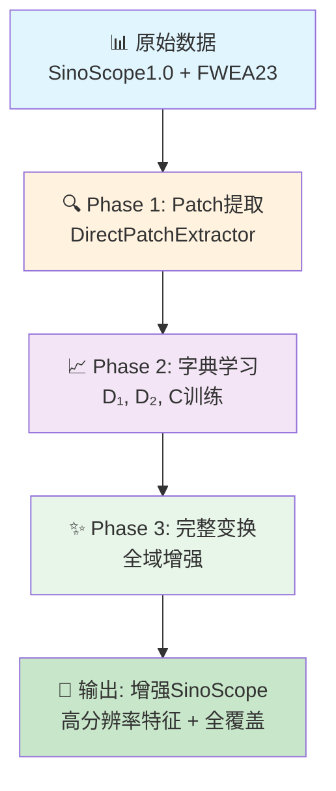
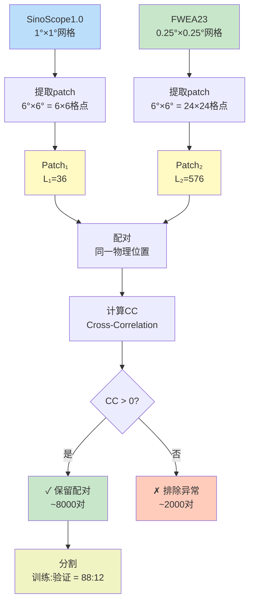
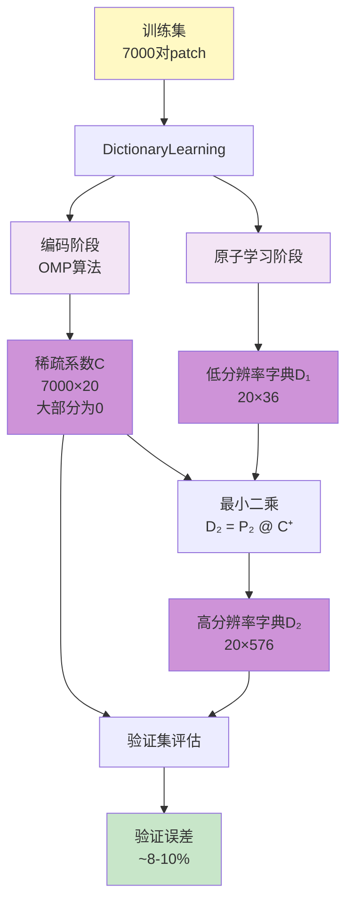
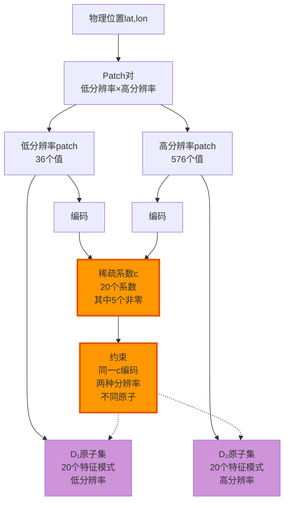
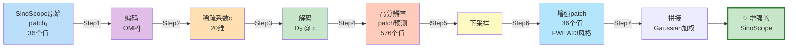
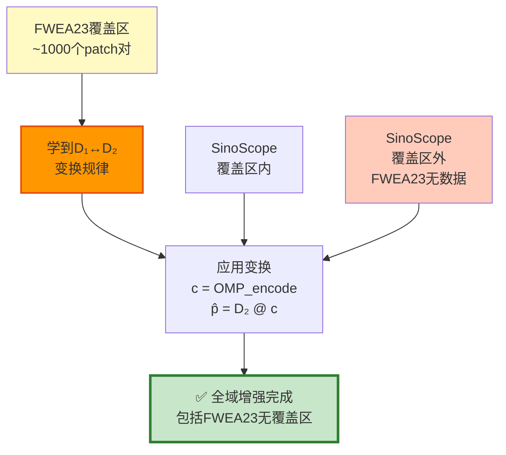
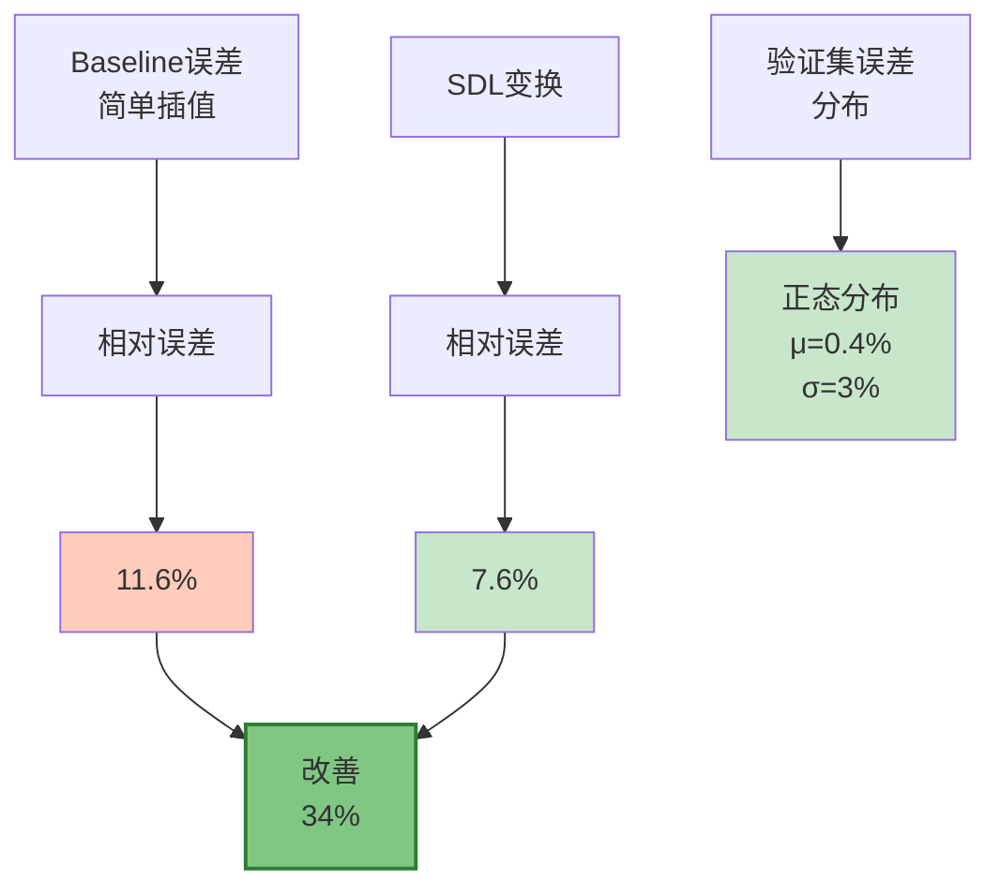
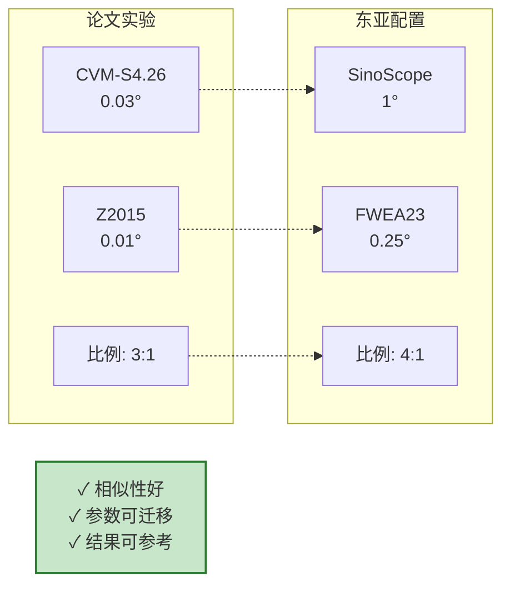
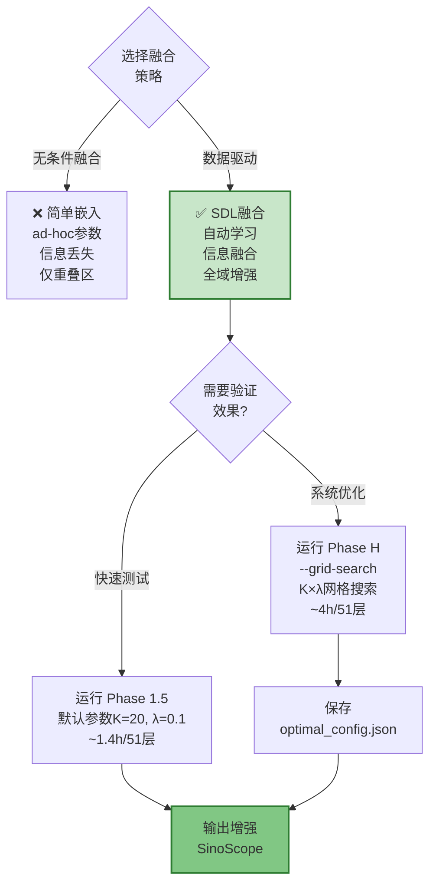
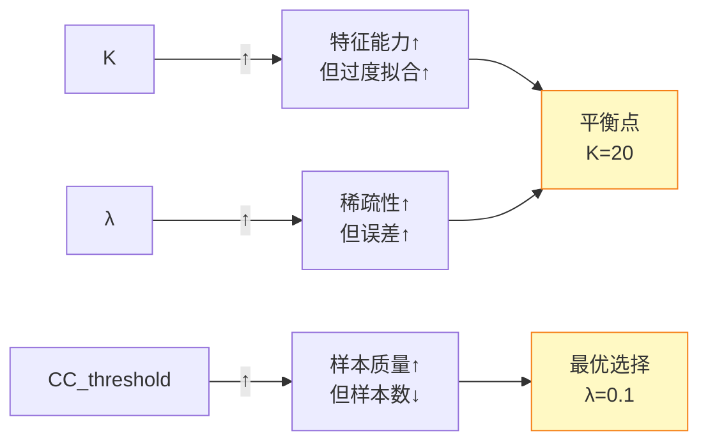

# SDL 融合技术的核心算法动画 (Mermaid)

## 1. 高层流程（简化视图）

## 2. Patch 提取细节（Phase 1）

## 3. 字典学习详解（Phase 2）

## 4. 核心约束：共享稀疏系数

## 5. 完整变换流程（Phase 3：核心！）

## 6. 为什么能全域增强？

## 7. 误差与改善

## 8. 与论文场景对比

## 9. 关键决策树

## 10. 参数敏感性

