# Custom instructions for Copilot

# EASTASIA-FWI 全波形反演项目 - 完整开发设计文档

<style>
/* 统一 Mermaid 流程图大小 */
.mermaid {
  max-width: 700px;
  margin: 0 auto;
}
</style>

> **项目全称**: East Asia Full Waveform Inversion  
> **开源代码**: SMART-py (Seismic Model Assessment and Reconciliation Toolbox in Python)  
> **文档版本**: v2.2.0  
> **创建日期**: 2026-01-12  
> **最后更新**: 2026-03-25  
> **文档类型**: 主开发设计文档（总纲）

---

## 📚 目录

1. [项目概述与科学目标](#1-项目概述与科学目标)
2. [研究区域与数据资源](#2-研究区域与数据资源)
3. [技术架构总览](#3-技术架构总览)
4. [模块详细设计](#4-模块详细设计)
5. [核心方法论与算法](#5-核心方法论与算法)
6. [数据流与处理流程](#6-数据流与处理流程)
7. [全流程可视化体系](#7-全流程可视化体系)
8. [代码架构与规范](#8-代码架构与规范)
9. [开发状态与里程碑](#9-开发状态与里程碑)
10. [参考文献](#10-参考文献)

---

## 1. 项目概述与科学目标

### 1.1 项目概述

#### 科学背景

东亚地区横跨欧亚板块、太平洋板块与印度-澳大利亚板块的交汇地带，是全球构造最复杂、地震活动最频繁的区域之一。该区域孕育了青藏高原隆升、华北克拉通破坏、日本海沟俯冲等重大地质事件，对理解板块动力学、大陆演化和地震灾害机理具有关键意义。然而，现有的东亚岩石圈-上地幔速度模型存在以下问题：

- **模型众多但缺乏共识**：不同研究团队基于不同数据和方法构建的模型在关键构造特征上存在显著差异
- **分辨率与覆盖范围的权衡**：区域高分辨率模型难以拼接为全域一致的统一模型
- **初始模型选择的主观性**：全波形反演（FWI）对初始模型敏感，但缺乏客观的模型选择和融合标准

#### 项目定位

**EASTASIA-FWI** (East Asia Full Waveform Inversion) 是一个综合性地震学研究平台，致力于通过 **模型空间智能分析** 与 **数据空间波形验证** 相结合的创新方法，系统性地评估、融合现有速度模型，并最终通过大规模全波形反演构建新一代 **标准东亚岩石圈模型 SEAM 1.0** (Standard East Asian lithospheric Model)。

项目基于 **SPECFEM3D Globe** 谱元法正演引擎，采用 Python 生态系统（ObsPy、scikit-learn、PyGMT 等）构建完整的数据处理、模型分析和可视化工具链，形成可复用、可扩展的开源科研框架 **SMART-py** (Seismic Model Assessment and Reconciliation Toolbox in Python)。

#### 核心方法论

本项目采用"**双空间协同**"的技术路线：

| 分析维度       | 方法                            | 目标                             |
| -------------- | ------------------------------- | -------------------------------- |
| **模型空间**   | 聚类分析、SSIM 相似性、机器学习 | 量化模型差异，识别代表性模型     |
| **数据空间**   | SPECFEM3D 正演、波形拟合评分    | 用观测数据验证模型预测能力       |
| **模型融合**   | BMA、投票法、SDL 迁移学习       | 集成多模型优势，构建最优初始模型 |
| **全波形反演** | 伴随态方法 (Adjoint-state FWI)  | 精细化反演得到 SEAM 1.0          |

#### 预期产出

本项目计划形成三篇高水平学术论文：

| 序号          | 目标期刊                  | 主题           | 核心内容                                                  |
| ------------- | ------------------------- | -------------- | --------------------------------------------------------- |
| **Paper I**   | _JGR: Solid Earth_        | 模型对比与融合 | 东亚现有岩石圈-地幔模型的系统对比、定量评价与智能融合方法 |
| **Paper II**  | _Computers & Geosciences_ | 方法与软件     | SMART-py 开源工具箱：全波形成像预处理全流程技术文档       |
| **Paper III** | _Nature/Science_ 子刊系列 | SEAM 1.0 模型  | 新一代标准东亚岩石圈模型及其地球动力学意义                |

#### 技术特色

- **开源可复现**：全部代码开源于 GitHub，遵循 FAIR 数据原则
- **模块化设计**：六大功能模块独立运行，支持灵活组合
- **高性能计算**：支持 MPI 并行，适配超算平台（曙光、天河等）
- **标准化流程**：从数据下载到模型产出的端到端自动化

### 1.2 科学目标

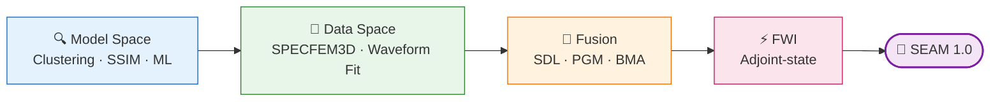

### 1.3 创新点

| 创新维度         | 传统方法     | 本项目方法               | 优势                       |
| ---------------- | ------------ | ------------------------ | -------------------------- |
| **初始模型选择** | 单一模型     | 多模型智能融合           | 集成多源信息，减少偏差     |
| **模型评估**     | 简单对比     | 聚类+SSIM 相似性量化分析 | 客观、可重复、高效         |
| **分辨率增强**   | 简单插值     | SDL 迁移学习             | 粗模型继承高分辨率细节特征 |
| **融合方法**     | 简单平均     | BMA/投票/PGM 多方法对比  | 评分驱动，最优方案选择     |
| **模型验证**     | 静态分析     | 波形正演+拟合评分        | 数据驱动，物理约束         |
| **最终产品**     | 区域模型拼接 | 全域一致性高精度模型     | SEAM 1.0 东亚标准模型      |

### 1.4 Open Issues & 待讨论

| #   | 问题                                                                                             | 类型     | 影响范围  | 状态    |
| --- | ------------------------------------------------------------------------------------------------ | -------- | --------- | ------- |
| 1.1 | SEAM 1.0 的范围/目标分辨率/质量指标尚未量化定义（"优于现有模型"需具体化为 CC/misfit 改善百分比） | 目标定义 | 全项目    | 🟡 中期 |
| 1.2 | Paper III (Nature/Science 子刊) 的差异化卖点是什么？模型本身还是发现了新的地球动力学现象？       | 科学定位 | Paper III | 🔵 远期 |

---

## 2. 研究区域与数据资源

### 2.1 研究区域定义

| 参数     | 范围         |
| -------- | ------------ |
| **区域** | East Asia    |
| **经度** | 60°E ~ 170°E |
| **纬度** | 15°S ~ 60°N  |
| **深度** | 0 ~ 1000 km  |

### 2.2 速度模型库

**Overview**: 23 models | ~35,500,000 data points | 2018-2025

#### Table 1: Model Coverage

| No. | Model             | Year | Type  | Depth (km) | Lon (°E) | Lat (°N) | Points |
| --- | ----------------- | ---- | ----- | ---------- | -------- | -------- | ------ |
| 1   | CSEM_Japan        | 2018 | Vs    | 0-350      | 120~150  | 20~50    | 893K   |
| 2   | FWEA18            | 2018 | Vp+Vs | 0-800      | 90~150   | 10~60    | 3,924K |
| 3   | TP2019            | 2020 | Vs    | 25-700     | 74~108   | 27~42    | 152K   |
| 4   | Banda_ANT_CrustVs | 2021 | Vs    | 0-50       | 118~129  | -11~-8   | 10K    |
| 5   | Chen_SChinaSea    | 2021 | Vs    | 0-250      | 95~135   | -10~30   | 42K    |
| 6   | KEA20             | 2021 | Vs    | 25-250     | 70~150   | 15~51    | 1,815K |
| 7   | SWChinaCVM-1.0    | 2021 | Vp+Vs | 0-50       | 97~108   | 21~34    | 7K     |
| 8   | Chen_SChina       | 2022 | Vs    | 0-150      | 109~122  | 21~36    | 24K    |
| 9   | Kumar_Pamir       | 2022 | Vs    | 0-100      | 69~85    | 28~42    | 386K   |
| 10  | SASSY21           | 2022 | Vs    | 150-600    | 92~140   | -15~15   | 953K   |
| 11  | SinoScope1.0      | 2022 | Vp+Vs | 0-2800     | 50~165   | -10~58   | 1,129K |
| 12  | Toyokuni_SEAsia   | 2022 | Vp    | 0-2900     | 90~140   | -20~20   | 403K   |
| 13  | USTClitho2.0      | 2022 | Vp+Vs | 0-150      | 72~136   | 18~54    | 113K   |
| 14  | Cao_SETibet       | 2023 | Vs    | 0-100      | 100~105  | 26~32    | 37K    |
| 15  | CSRM-1.0          | 2023 | Vp+Vs | 0-100      | 68~135   | 17~54    | 4,694K |
| 16  | SWChinaCVMv2.0    | 2023 | Vp+Vs | 0-50       | 98~107   | 22~33    | 32K    |
| 17  | Wu_NETibet        | 2023 | Vs    | 0-75       | 97~109   | 32~42    | 5K     |
| 18  | ASIA2024          | 2024 | Vp+Vs | 0-690      | -14~180  | -20~80   | 5,952K |
| 19  | CSES_VM1.0        | 2024 | Vp+Vs | 0-75       | 98~107   | 21~35    | 104K   |
| 20  | EARA2024          | 2024 | Vp+Vs | 0-1000     | 80~160   | 10~60    | 6,517K |
| 21  | FWEA23            | 2024 | Vp+Vs | 0-1000     | 65~150   | -5~55    | 8,300K |
| 22  | Gao_NEChina       | 2025 | Vp    | 0-2500     | 111~151  | 31~51    | 11K    |
| 23  | Han_NEChina       | 2025 | Vs    | 0-2500     | 116~133  | 40~49    | 4K     |

#### Table 2: Model References

| No. | Model             | Reference                 | DOI                             |
| --- | ----------------- | ------------------------- | ------------------------------- |
| 1   | CSEM_Japan        | Fichtner et al., 2018 GRL | 10.1029/2018GL077338            |
| 2   | FWEA18            | Tao et al., 2018 G3       | 10.1029/2018GC007460            |
| 3   | TP2019            | Xiao et al., 2020 JGR     | 10.1029/2019JB018344            |
| 4   | Banda_ANT_CrustVs | Zhang & Miller, 2021 GRL  | 10.1029/2020GL089632            |
| 5   | Chen_SChinaSea    | Chen et al., 2021 G3      | 10.1029/2020GC009356            |
| 6   | KEA20             | Witek et al., 2021 JGR    | 10.1029/2020JB021201            |
| 7   | SWChinaCVM-1.0    | Liu et al., 2021 SRL      | 10.1785/0220200318              |
| 8   | Chen_SChina       | Chen et al., 2022 JGR     | 10.1029/2022JB024776            |
| 9   | Kumar_Pamir       | Kumar et al., 2022 JGR    | 10.1029/2021JB022574            |
| 10  | SASSY21           | Wehner et al., 2022 JGR   | 10.1029/2021JB022930            |
| 11  | SinoScope1.0      | Ma et al., 2022 JGR       | 10.1029/2022JB024957            |
| 12  | Toyokuni_SEAsia   | Toyokuni et al., 2022 JGR | 10.1029/2022JB024298            |
| 13  | USTClitho2.0      | Han et al., 2022 SRL      | 10.1785/0220210122              |
| 14  | Cao_SETibet       | Cao et al., 2023 Tecto    | 10.1016/j.tecto.2022.229690     |
| 15  | CSRM-1.0          | Wen & Yu, 2023 EPP        | 10.26464/epp2023078             |
| 16  | SWChinaCVMv2.0    | Liu et al., 2023 SCES     | 10.1007/s11430-022-1161-7       |
| 17  | Wu_NETibet        | Wu et al., 2023 JGR       | 10.1029/2022JB026109            |
| 18  | ASIA2024          | Dou et al., 2024 ESR      | 10.1016/j.earscirev.2024.104841 |
| 19  | CSES_VM1.0        | Wu et al., 2024 SCES      | 10.1007/s11430-023-1293-4       |
| 20  | EARA2024          | Xi et al., 2024 GJI       | 10.1093/gji/ggae302             |
| 21  | FWEA23            | Liu et al., 2024 EPSL     | 10.1016/j.epsl.2024.118764      |
| 22  | Gao_NEChina       | Gao et al., 2025 NC       | 10.1038/s41467-025-58053-5      |
| 23  | Han_NEChina       | Han et al., 2025 GJI      | 10.1093/gji/ggaf070             |

#### Model Roles (SDL/Fusion Pipeline)

| Role                     | Models                                     |
| ------------------------ | ------------------------------------------ |
| **Low-Resolution (LR)**  | SinoScope1.0, CSRM-1.0                     |
| **High-Resolution (HR)** | EARA2024, FWEA23, USTClitho2.0, CSES_VM1.0 |
| **Validation**           | FWEA18, KEA20, SASSY21                     |
| **Regional Constraint**  | Other regional models                      |

### 2.3 地震数据资源

项目采用**双数据库架构**，分别服务于正演测试验证和全波形反演两个阶段：

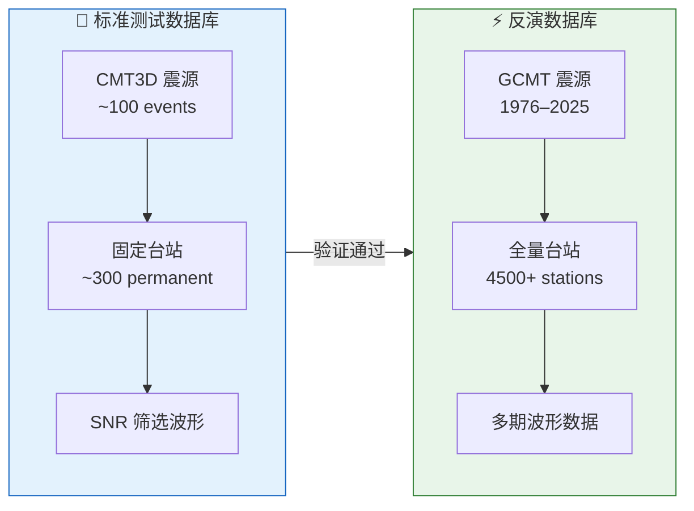

#### 2.3.1 标准测试数据库（正演验证用）

> **目的**：用少量高质量数据快速验证 SPECFEM3D 正演流程、模型转换精度和波形拟合能力。

**① CMT3D 震源库**

| 参数         | 值                                            |
| ------------ | --------------------------------------------- |
| 来源         | GCMT3D Catalog (Sawade et al., 2022, GJI)     |
| 参考模型     | GLAD-M25（三维非均匀地球模型）                |
| 全球事件总数 | 9,382                                         |
| 东亚区域事件 | 4,344（-15°~60°N, 60°~170°E）                 |
| 时间范围     | 2001-01 ~ 2019-11                             |
| 震源机制精度 | 经 3D 波形拟合修正，优于标准 GCMT 1D 解       |
| 数据格式     | CMTSOLUTION 格式（13行/事件）                 |
| 测试子集规模 | ~100 events（需挑选，覆盖不同深度/机制/震级） |

CMT3D 相比标准 GCMT 的优势在于震源参数（位置、深度、矩张量）经过三维结构模型的全波形拟合修正，
与真实地球结构更一致，适合作为正演模拟的"ground truth"震源。

**② 固定台站集**

| 参数       | 值                                      |
| ---------- | --------------------------------------- |
| 永久台站数 | 293 (经筛选的长期运行台站)              |
| 核心台网   | IC, IU, II, G, GE, AU, MY, JP, MM, KZ   |
| 覆盖范围   | 研究区域全覆盖，含参考台站              |
| 数据来源   | IRIS FDSN (EastAsia_permanent_stations) |

**③ 波形质控标准**

- 信噪比 (SNR) 筛选：体波 ≥ 5.0，面波 ≥ 3.0
- 频段匹配 SPECFEM 模拟周期（T > 10s）
- 剔除仪器响应异常记录
- 参考 FWEA23 使用的质控流程

#### 2.3.2 反演数据库（全波形反演用）

> **目的**：最大化台站覆盖和事件数量，为全波形反演提供充足的数据约束。

**① 台站资源现状**

| 类别         | 数量   | 台网数 | 说明                         |
| ------------ | ------ | ------ | ---------------------------- |
| 我方全量台站 | 4,513  | 123    | IRIS FDSN 可公开获取         |
| 永久台站     | 293    | ~15    | 长期运行，数据连续性好       |
| 临时部署     | ~4,220 | ~108   | 科学实验，覆盖密集但时间有限 |

**② 与 FWEA23 台站对比分析** (`5_4_Station_Comparison.py`)

| 对比项    | FWEA23 (参考)        | 我方 (IRIS) | 差异分析                   |
| --------- | -------------------- | ----------- | -------------------------- |
| 台站总数  | 1,401                | 4,513       | 我方多 3,112 站（+222%）   |
| 台网数    | 66                   | 123         | 我方多 57 个台网           |
| 共同台网  | 35                   | 35          | 完全重叠                   |
| 仅 FWEA23 | **31 台网 / 814 站** | —           | **关键缺口：中国省级台网** |
| 仅我方    | —                    | 88 台网     | 主要为临时部署实验         |

**③ 关键缺口：FWEA23 拥有但我们缺少的中国省级台网**

这是我方数据的最大短板——FWEA23 使用了大量中国地震局全国测震台网数据（非 IRIS 公开）：

http://www.esdc.ac.cn/class/16 :中国地震局地球物理研究所地震科学数据中心收集了包括2008年以来原“国家数字测震台网数据备份中心”接收的145个国家台网地震台站、816个省局区域地震台网地震台站、70个卫星传输的地震台站、10个CDSN地震台站、10个和田台阵地震台站、9个那曲台阵地震台站共1017个地震台站的信号

| 省级台网代码 | 台站数    | 省份        | 台网代码 | 台站数  | 省份      |
| ------------ | --------- | ----------- | -------- | ------- | --------- |
| BO           | 73        | 渤海/环渤海 | SC       | 58      | 四川      |
| YN           | 48        | 云南        | GS       | 42      | 甘肃      |
| 6A           | 40        | (区域实验)  | NM       | 39      | 内蒙古    |
| JS           | 35        | 江苏        | LN       | 33      | 辽宁      |
| SX           | 32        | 山西        | HE       | 31      | 河北      |
| QH/SD        | 30 each   | 青海/山东   | SN       | 28      | 陕西      |
| HL           | 28        | 黑龙江      | FJ       | 26      | 福建      |
| BU/HB        | 25 each   | /湖北       | JX       | 24      | 江西      |
| JL           | 23        | 吉林        | HI       | 22      | 海南      |
| AH           | 20        | 安徽        | XZ       | 16      | 西藏      |
| HA/HN        | 14-15     | 河南/湖南   | BJ/CQ    | 12 each | 北京/重庆 |
| NX           | 11        | 宁夏        | SH       | 7       | 上海      |
| **合计**     | **814站** |             |          |         |           |

> ⚠️ 这 814 个省级台站是 FWEA23 的重要数据优势，大部分位于中国大陆内部，
> 对岩石圈结构约束至关重要。获取途径：中国地震局数据共享平台、合作单位交换。

**④ 未来可新增台站资源（2020–2026 新部署）**

近 5-6 年中国在青藏高原及周边地区进行了大规模密集台阵布设，CMT3D 目录截止
2019 年 11 月，无法涵盖这些新台站的运行时段，因此反演数据库的震源需从标准 GCMT
目录中选取：

| 项目/台阵          | 预计台站数 | 部署时间  | 覆盖区域     |
| ------------------ | ---------- | --------- | ------------ |
| ChinArray 123期    | ~2000+     | 2010–2025 | 华北/西南    |
| 外蒙古台阵         | ~？        | ？？      | 外蒙古中部   |
| 日本+韩国          | ~200       | 2023–2025 | 太平洋俯冲域 |
| 印度               | ~30        | ？？      | 印度板块     |
| 其他 FDSN 新增台网 | ~100+      | 2020–2025 | 散布各区域   |

> 💡 **策略**：通过 IRIS FDSN 查询 2020-2026 年新注册台站，补充到反演数据库；
> 同时通过合作渠道获取中国省级台网数据以填补 FWEA23 的 814 站缺口。

**⑤ 震源目录体系**

| 目录名称     | 时间范围     | 东亚事件数 | 震源精度    | 用途           |
| ------------ | ------------ | ---------- | ----------- | -------------- |
| **CMT3D**    | 2001–2019.11 | 4,344      | 3D 波形修正 | 标准测试数据库 |
| **GCMT**     | 1976–2025    | ~15,000+   | 1D 模型反演 | 反演数据库     |
| 已选事件子集 | 2010–2024    | 77         | GCMT 标准   | 当前正演测试用 |

反演数据库震源从 GCMT 中挑选的标准：

- 震级 Mw ≥ 5.5（确保信噪比）
- 覆盖不同深度范围：浅源(<70km) / 中源(70-300km) / 深源(>300km)
- 方位角覆盖均匀（相对台站分布）
- 避免震源密集簇（空间去相关）
- 事件时间覆盖台站运行时段（特别是 2020年+ 新台站需 2020年+ 事件）

### 2.4 Open Issues & 待讨论

| #   | 问题                                                                                                                     | 类型     | 影响范围   | 状态      |
| --- | ------------------------------------------------------------------------------------------------------------------------ | -------- | ---------- | --------- |
| 2.1 | CMT3D 截止 2019.11，2020+ 新台站（喜马拉雅 1/2/3 期）无法使用 3D 修正震源，是否需要自行对 GCMT 震源做 CMT3D 级别的修正？ | 数据质量 | 测试数据库 | 🔴 需决策 |
| 2.2 | 814 个中国省级台网（FWEA23 独有）的获取渠道尚未落实——是否已有合作单位可提供？如不能获取，是否接受用临时台站替代？        | 数据获取 | 反演数据库 | 🔴 需行动 |
| 2.3 | 标准测试数据库 ~100 个 CMT3D 事件的挑选标准：是否应与模块 2 聚类结果联动（优先选模型分歧大的区域）？                     | 方法设计 | 测试数据库 | 🟡 需讨论 |
| 2.4 | 喜马拉雅计划等新台站的 FDSN 公开数据是否已就绪？部分项目可能有 embargo period                                            | 数据可用 | 反演数据库 | 🟡 需核实 |
| 2.5 | 研究区域南界 -15°S 是否过大？大部分模型和台站覆盖不到 -10°S 以南，扩大区域增加计算量但无数据约束                         | 区域定义 | 全项目     | 🟡 需讨论 |
| 2.6 | 23 个速度模型中部分为小区域模型（如 Cao_SETibet 仅 5°×6°），纳入全域融合的代价收益比是否合理？                           | 模型筛选 | §4 融合    | 🔵 低优先 |

---

## 3. 技术架构总览

### 3.1 系统架构图

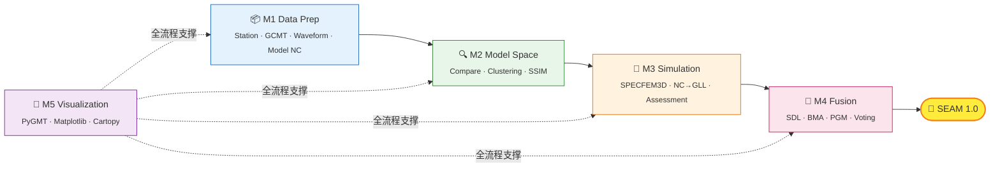

### 3.2 核心技术栈

| 层级           | 技术                            | 用途                          |
| -------------- | ------------------------------- | ----------------------------- |
| **正演模拟**   | SPECFEM3D Globe v7.0.0 (修改版) | 地震波正演/伴随状态反演       |
| **地震学处理** | ObsPy, SAC                      | 波形数据读写、处理、分析      |
| **机器学习**   | scikit-learn, scikit-image      | 聚类、字典学习、相似性分析    |
| **模型转换**   | scipy, xarray, h5py             | NC/HDF5/CSV → GLL 格式转换    |
| **地理可视化** | PyGMT, GMT, Cartopy             | 地球物理地图绑制              |
| **数据可视化** | Matplotlib, Seaborn             | 统计图表、热力图              |
| **数据格式**   | NetCDF (xarray), HDF5           | 多维速度模型存储              |
| **HPC**        | Slurm, Intel MPI 2018           | 曙光超算作业调度 (4×36=144核) |

> **SPECFEM 版本说明**: 项目使用 Chujie 修改版 SPECFEM3D Globe v7.0.0，支持区域 chunk 配置（`sem_config_tibet_v4`）。v8.1.0 官方版本也已测试，但在曙光集群上存在间歇性 MPI 通信问题（face flag error），待与曙光工程师协调解决。

### 3.3 Open Issues & 待讨论

| #   | 问题                                                                                                         | 类型     | 影响范围  | 状态      |
| --- | ------------------------------------------------------------------------------------------------------------ | -------- | --------- | --------- |
| 3.1 | SPECFEM v7.0.0 (Chujie 修改版) vs v8.1.0 官方版的长期选择：v7.0.0 功能足够但不再维护，v8.1.0 有 MPI 兼容问题 | 技术选型 | §4.3 正演 | 🔴 需决策 |
| 3.2 | Intel MPI 2018.4 是曙光集群默认环境，但已过时 5+ 年——是否需要请管理员升级或测试 OpenMPI？                    | 环境     | HPC       | 🟡 需讨论 |
| 3.3 | 当前 4 节点 × 36 核 = 144 MPI 是否为最优配置？NEX 12×12 对应 NPROC=144 是硬约束还是可调整？                  | 计算资源 | HPC       | 🟡 需确认 |

---

## 4. 模块详细设计

### 4.1 模块 1: 数据准备 (Data Preparation)

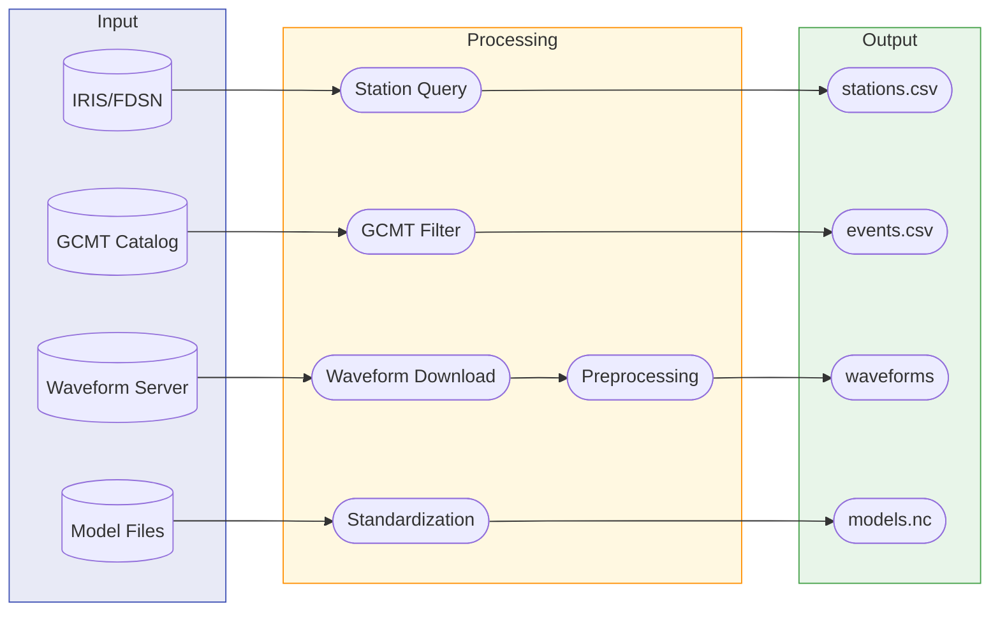

#### 4.1.1 台站查询 (1_1_Query_stations.py)

**功能**: 从 IRIS/FDSN 服务查询研究区域内的地震台站

```python
class StationQuerier:
    """
    台站查询器

    功能:
    - 查询 IRIS/FDSN 数据中心
    - 筛选永久/临时台站
    - 计算台站密度分布
    - 输出标准格式台站列表

    输出:
    - stations_permanent.csv: 永久台站列表
    - stations_temporary.csv: 临时部署台站
    - station_density.nc: 台站密度网格
    """
```

#### 4.1.2 GCMT 目录处理 (1_2_Process_gcmt_catalogs.py)

**功能**: 处理和筛选 GCMT 地震目录

**筛选标准**:

- Mw >= 5.5 (确保高信噪比)
- 深度: 全深度 (浅/中/深源)
- 时间: 1990-2024 (数字化时代)

#### 4.1.3 波形下载 (1_3_Download_waveforms.py)

**功能**: 批量下载地震波形数据

| 参数 | 值                        |
| ---- | ------------------------- | -------------------- |
| 分量 | BHZ, BHN, BHE (三分量)    |
| 时窗 | P 波前 100s, S 波后 3500s |
| 5    | 采样率                    | 1 Hz (长周期) / 原始 |

#### 4.1.4 波形预处理 (1_4_Preprocess_waveforms.py)

**处理流水线**:

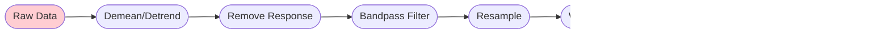

#### 4.1.5 速度模型处理 (1_5_Process_velocity_models.py)

**标准化输出格式**:

| 属性 | 规范                                 |
| ---- | ------------------------------------ |
| 坐标 | (latitude, longitude, depth)         |
| 参数 | vs, vp, vsv, vsh, vpv, vph, rho, eta |
| 单位 | km/s, km, g/cm³                      |
| 格式 | NetCDF4 (CF-compliant)               |

> **Open Issues**:
>
> - 🟡 SNR 阈值（体波 5.0/面波 3.0）未经统计验证，不同周期段差异大
> - 🔵 1 Hz 采样率对 T>17s 足够，扩展短周期需重下载（低优先）

---

### 4.2 模块 2: 模型空间分析 (Model Space Analysis)

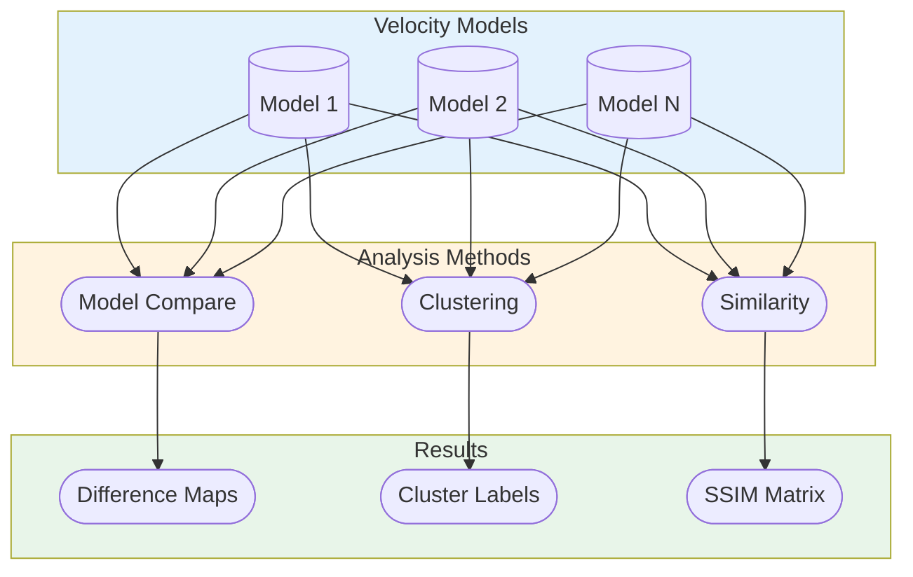

#### 4.2.1 模型对比 (2_1_Model_compare.py)

**对比指标**:

| 指标 | 公式                                    | 说明       |
| ---- | --------------------------------------- | ---------- |
| RMSE | $\sqrt{\frac{1}{N}\sum(v_1-v_2)^2}$     | 均方根误差 |
| CC   | $\frac{Cov(v_1,v_2)}{\sigma_1\sigma_2}$ | 相关系数   |
| Bias | $\bar{v_1} - \bar{v_2}$                 | 系统偏差   |

#### 4.2.2 聚类分析 (2_2_Model_clustering.py)

**聚类方法**:

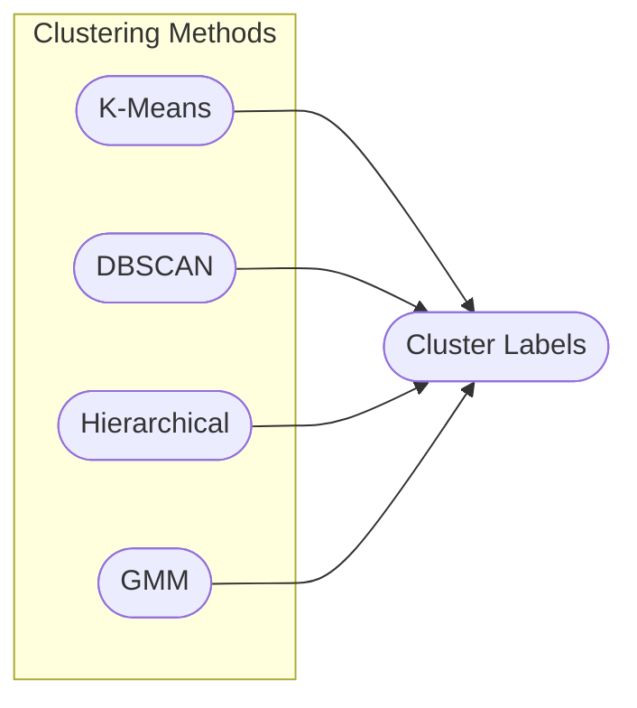

**GMM 聚类公式**:

$$P(x|\theta) = \sum_{k=1}^{K} \pi_k \mathcal{N}(x|\mu_k, \Sigma_k)$$

#### 4.2.3 相似性分析 (2_3_Model_similarity.py)

**SSIM 理论基础** (Wang et al., 2004):

$$\text{SSIM}(x,y) = [l(x,y)]^\alpha \cdot [c(x,y)]^\beta \cdot [s(x,y)]^\gamma$$

| 分量                | 公式                                                            | 物理含义           |
| ------------------- | --------------------------------------------------------------- | ------------------ |
| **亮度** $l(x,y)$   | $\frac{2\mu_x\mu_y + C_1}{\mu_x^2 + \mu_y^2 + C_1}$             | 平均速度水平差异   |
| **对比度** $c(x,y)$ | $\frac{2\sigma_x\sigma_y + C_2}{\sigma_x^2 + \sigma_y^2 + C_2}$ | 速度异常振幅差异   |
| **结构** $s(x,y)$   | $\frac{\sigma_{xy} + C_3}{\sigma_x\sigma_y + C_3}$              | 空间分布模式相似性 |

**SSIM 值解释**:

| SSIM 范围 | 相似性等级 | 地质解释                         |
| --------- | ---------- | -------------------------------- |
| 0.95-1.00 | 高度相似   | 模型结构基本一致                 |
| 0.85-0.95 | 较高相似   | 主要结构相似，细节差异           |
| 0.70-0.85 | 中等相似   | 存在显著区域差异                 |
| < 0.70    | 较低相似   | 模型差异大，可能反映不同地质解释 |

> **Open Issues**:
>
> - 🟡 不同深度层的最优聚类数 K 差异大（浅部 2-3，深部 4-5），是否应逐层自适应？
> - 🟡 SSIM 窗口大小选择及地震学语境下的物理意义需在 Paper I 中论述

---

### 4.3 模块 3: 数据空间模拟 (Data Space Simulation)

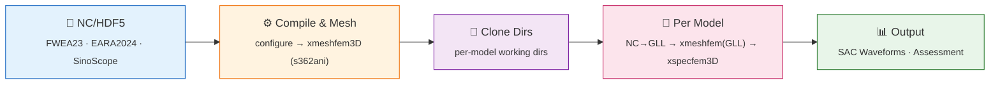

#### 4.3.1 多模型正演架构

项目采用**独立工作目录架构**，由统一脚本 `run_forward.bash` 驱动，支持多模型并行/顺序正演：

```
specfem/
├── run_forward.bash              ← 多模型正演主脚本
├── convert_nc_to_gll.py          ← NC/HDF5/CSV → GLL 转换
├── DATA/                         ← 共享配置 (Par_file, STATIONS, CMTSOLUTION)
├── models/                       ← 原始模型文件
│   ├── FWEA23.r0.0-n4.nc
│   ├── EARA2024.r0.0-n4.nc
│   └── FWI_SinoScope_1.0.h5
├── specfem3d_globe_code_new/     ← SPECFEM 源码 (v7.0.0)
├── sem_config_tibet_v4/          ← 原作者配置 (constants.h.in)
├── FWEA23/                       ← 独立工作目录 (模板)
│   ├── DATA/GLL/                 ← 模型 GLL 文件
│   ├── DATABASES_MPI/            ← 网格数据
│   ├── OUTPUT_FILES/             ← 合成波形
│   └── bin/                      ← 可执行文件
├── EARA2024/                     ← 独立工作目录 (克隆自 FWEA23)
└── SinoScope/                    ← 独立工作目录 (克隆自 FWEA23)
```

#### 4.3.2 模型注册表

| 模型名    | 文件                   | 格式 | 转换参数                                                   |
| --------- | ---------------------- | ---- | ---------------------------------------------------------- |
| FWEA23    | `FWEA23.r0.0-n4.nc`    | NC   | `--anisotropic --use-perturbation --horizontal-fill blend` |
| EARA2024  | `EARA2024.r0.0-n4.nc`  | NC   | `--anisotropic --use-perturbation --horizontal-fill blend` |
| SinoScope | `FWI_SinoScope_1.0.h5` | HDF5 | `--anisotropic --horizontal-fill blend`                    |

#### 4.3.3 convert_nc_to_gll.py 核心流程

NC/HDF5/CSV 速度模型 → SPECFEM GLL 格式的转换是正演模拟的关键环节：

| 步骤 | 操作                 | 说明                                              |
| ---- | -------------------- | ------------------------------------------------- |
| 1    | 读取 solver_data.bin | 获取 GLL 点坐标 (x,y,z) 和 ibool 拓扑             |
| 2    | 唯一点去重           | ibool 展开 ~90万点 → ~20万唯一点，节省 ~75% 计算  |
| 3    | 坐标转换             | 非量纲 (x,y,z) → 地理 (lat, lon, depth_km)        |
| 4    | NaN 预填充           | nearest 填充消除 NC 中 NaN 对插值的污染           |
| 5    | 插值                 | linear/cubic + 可选扰动插值 (model-ref → 更平滑)  |
| 6    | 域外填充             | 深部→1DREF, 水平域外→nearest/ref/blend            |
| 7    | 写出 GLL             | Fortran 无格式二进制，与 SPECFEM CUSTOM_REAL 一致 |

支持的输入格式：

- **NetCDF (.nc)**: EMC 标准格式（FWEA23, EARA2024 等），支持各向异性 (vpv/vph/vsv/vsh/eta/rho)
- **HDF5 (.h5)**: SinoScope 等自定义格式，自动单位转换 (m/s→km/s)
- **CSV (.csv)**: 通用表格格式 (lon, lat, depth, vp, vs, rho)

#### 4.3.4 SPECFEM 关键参数

| 参数                 | 值          | 说明               |
| -------------------- | ----------- | ------------------ |
| NCHUNKS              | 1           | 区域 chunk         |
| NEX_XI / NEX_ETA     | 12×12=144   | 水平网格数 → NPROC |
| MODEL                | s362ani/GLL | Phase 2/4 切换     |
| ABSORBING_CONDITIONS | .true.      | 吸收边界           |
| SIMULATION_TYPE      | 1           | 正演模拟           |
| SAVE_MESH_FILES      | .false.     | 避免编译冲突       |
| MOVIE_VOLUME         | .false.     | 避免编译冲突       |

#### 4.3.5 五阶段正演流程

| Phase | 操作           | 说明                                      | 耗时   |
| ----- | -------------- | ----------------------------------------- | ------ |
| 1     | 编译           | configure + make xmeshfem3D + xspecfem3D  | ~15min |
| 2     | Mesh (s362ani) | 生成 GLL 网格坐标和参考弹性参数           | ~30min |
| 3     | 模型转换       | convert_nc_to_gll.py → DATA/GLL/          | ~5min  |
| 4     | Mesh (GLL)     | 用自定义 GLL 弹性参数重写 solver_data.bin | ~20min |
| 5     | Solver         | xspecfem3D 正演，输出 SAC 波形            | ~2-4h  |

#### 4.3.6 HPC 运行环境

| 参数     | 值                                             |
| -------- | ---------------------------------------------- |
| 集群     | 曙光 (tyhcnormal 分区)                         |
| 节点     | 4 nodes × 36 tasks/node = 144 MPI              |
| 编译器   | Intel Fortran 18.0.5 / Intel MPI 2018.4        |
| Python   | conda env `eastasia_fwi` (xarray, scipy, h5py) |
| 环境变量 | `ulimit -s unlimited`, `KMP_STACKSIZE=512m`    |

> **已知问题**: v7.0.0 和 v8.1.0 在曙光集群上间歇性出现 `face flag` MPI 通信错误，与特定节点/InfiniBand 网络状态相关。已在脚本中加入 `I_MPI_DEBUG=5` 等诊断参数，待与曙光工程师协调排查。

#### 4.3.7 波形评估指标体系

参考 Zhou et al. (2021, GJI) 的模型评估框架，采用四类 misfit 指标，结合分类加权和地理加权实现公平对比。

**① 单台站 Misfit 定义** (Tromp et al., 2005)

| 指标        | 公式                                                                                                          | 物理含义                                         |
| ----------- | ------------------------------------------------------------------------------------------------------------- | ------------------------------------------------ |
| 走时 misfit | $\chi_r^T = \frac{1}{2}[T_r^s - T_r^d]^2$                                                                     | 合成与观测走时差的平方                           |
| 振幅 misfit | $\chi_r^A = \frac{1}{2}[A_r^d / A_r^s - 1]^2$                                                                 | 振幅比偏离 1 的程度                              |
| 波形 misfit | $\chi_r^F = \frac{1}{2}\int_{t_s}^{t_e}[s(x_r,t) - d(x_r,t)]^2\,dt$                                           | 波形逐点最小二乘差                               |
| NZCC        | $\text{NZCC} = \frac{\int_{t_s}^{t_e} s(x_r,t) \cdot d(x_r,t)\,dt}{\sqrt{\int \|s\|^2\,dt \int \|d\|^2\,dt}}$ | 归一化零延迟互相关，反映相位匹配和波形形态相似度 |

其中 $s(x_r, t)$ 和 $d(x_r, t)$ 分别为合成波形和观测数据，$T_r^s, T_r^d$ 为互相关测量的走时，$A_r^s, A_r^d$ 为振幅。

**② 加权总 Misfit**

为实现不同模型的公平对比，走时和振幅 misfit 需除以测量误差标准差 $\sigma_r$ 进行归一化，并施加分类加权 $W_c$ 和地理加权 $W_r$：

$$\chi^T = \frac{1}{2CN}\sum_{c}^{C}\sum_{r}^{N} W_c W_r \left(\frac{T_r^s - T_r^d}{\sigma_r}\right)^2$$

$$\chi^A = \frac{1}{2CN}\sum_{c}^{C}\sum_{r}^{N} W_c W_r \left(\frac{A_r^d/A_r^s - 1}{\sigma_r}\right)^2$$

$$\chi^F = \frac{1}{CN}\sum_{c}^{C}\sum_{r}^{N} W_c W_r \,\chi_r^F, \quad \chi^{NZCC} = \frac{1}{CN}\sum_{c}^{C}\sum_{r}^{N} W_c W_r (1 - \text{NZCC})$$

| 符号       | 含义                                              |
| ---------- | ------------------------------------------------- |
| $W_r$      | 地理加权（台站密度校正，避免密集台阵主导 misfit） |
| $W_c$      | 分类加权（平衡 6 个类别的测量窗口数差异）         |
| $\sigma_r$ | 测量误差（由 SPECFEM `MEASURE_ADJ` 估计）         |
| $C=6$      | 分类数：体波/面波 × Z/R/T 三分量                  |
| $N$        | 台站数                                            |

**③ 测量窗口与频段**

| 频段 (s) | 类型   | Rayleigh 速度 (km/s) | Love 速度 (km/s) | 敏感深度范围 |
| -------- | ------ | -------------------- | ---------------- | ------------ |
| 9–20     | 短周期 | 3.2                  | 3.7              | 地壳         |
| 20–40    | 中周期 | 3.3                  | 3.9              | 岩石圈       |
| 40–120   | 长周期 | 3.5                  | 4.2              | 上地幔       |

**窗口选择标准**：SNR > 4 且互相关系数 CC > 0.7。体波 P/S 窗口据震中距选取（近距仅 P(Pnl)，远距 P/S/面波），面波窗口据经验群速度定义。

**④ 震源修正**

使用 CMT3D 方法（Liu et al., 2004）结合 Rayleigh 波网格搜索（Jia et al., 2017）对每个事件的矩张量和深度重新反演，消除 1D 震源解的偏差对模型评估的影响。

> **参考文献**: Zhou, T., et al. (2021). Assessment of seismic tomographic models of the contiguous United States using full-waveform simulation. GJI, 228(2), 1392-1414. https://doi.org/10.1093/gji/ggab406

> **Open Issues**:
>
> - 🔴 **SPECFEM face flag MPI 间歇性错误** — 正演流程，v7.0.0/v8.1.0 均出现，待曙光工程师排查
> - 🔴 **NC→GLL 插值精度 vs 原生 GLL 精度差异** — `convert_nc_to_gll.py` 对规则网格 NC 做三线性/三次插值到 GLL 非结构点，必然引入插值误差（尤其在速度跳变界面如 Moho、LAB），无法达到原生 GLL 精度。目前仅 FWEA23 有 Chujie 提供的原生 GLL 文件（反演过程直接输出），EARA2024 和 SinoScope 只能走 NC→GLL 转换路径。这导致模型对比存在**不公平性**：FWEA23 用原生 GLL 天然精度最高，其他模型因插值损失精度。**以前怎么处理**：传统全波形反演研究（如 FWEA23、EARA2024 自身）不存在此问题，因为模型在 GLL 网格上迭代优化本身就产生原生 GLL。多模型对比正演（如本项目）是非典型场景，现有文献缺少标准做法。**可能解决路径**：(1) 联系 EARA2024/SinoScope 作者获取原生 GLL 文件；(2) 提高 NC 分辨率后再转换（EMC 下载更密网格）；(3) 用 FWEA23 同时做 NC→GLL 和原生 GLL 对比，量化插值误差作为系统偏差校正基线
> - 🟡 扰动插值依赖 s362ani 参考模型精度——局部偏差大时误差会传播到 GLL
> - 🟡 三模型正演使用同一 CMTSOLUTION/STATIONS 还是各自优化？
> - 🟡 波形评估指标体系已参考 Zhou et al. (2021) 设计（4 类 misfit + 分类/地理加权），具体优化 `3_4_Waveform_assessment.py` 编码

---

### 4.4 模块 4: 模型融合 (Multi-scale Model Fusion)

本项目的速度模型融合涉及**三个尺度层次**的 23 个模型，需要系统性的融合策略。

#### 4.4.0 多尺度模型分类与融合策略总览

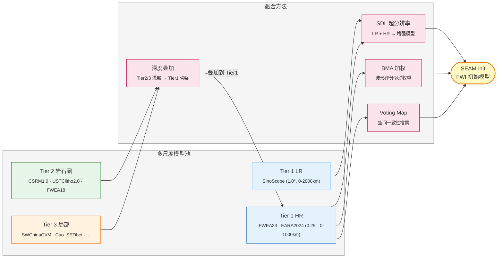

**模型分类与角色**：

| 层级       | 模型                          | 分辨率    | 深度     | 角色     | 融合方式                                     |
| ---------- | ----------------------------- | --------- | -------- | -------- | -------------------------------------------- |
| **Tier 1** | FWEA23, EARA2024              | 0.25°     | 0-1000km | 全域骨架 | 直接用作 FWI 初始模型 / BMA / SDL 高分辨率端 |
| **Tier 1** | SinoScope1.0                  | 1.0°      | 0-2800km | 全域基础 | SDL 低分辨率端                               |
| **Tier 2** | CSRM1.0, USTClitho2.0, FWEA18 | 0.25-0.5° | 0-150km  | 区域约束 | 岩石圈深度叠加                               |
| **Tier 3** | SWChinaCVM, Cao_SETibet 等    | 0.05-0.1° | 0-100km  | 局部细节 | 局部区域叠加                                 |
| **验证**   | KEA20, SASSY21, ASIA2024      | 各异      | 各异     | 交叉验证 | 不参与融合                                   |

#### 4.4.1 投票地图 (4_1_Voting_map.py)

基于模型间一致性的空间投票：

- 逐网格点统计模型间速度异常方向的一致性
- 多数投票 / 加权投票 / 软投票三种模式
- 输出各模型在每个空间点的可信度得分

#### 4.4.2 贝叶斯模型平均 BMA (4_2_BMA.py)

**核心公式**：

$$\theta_{BMA} = \sum_{k=1}^{K} P(M_k|D) \cdot \theta_k, \quad P(M_k|D) \propto P(D|M_k) \cdot P(M_k)$$

**不确定性分解**：

$$\text{Var}(\theta|D) = \underbrace{\sum_k P(M_k|D) \text{Var}(\theta|M_k)}_{\text{模型内}} + \underbrace{\sum_k P(M_k|D)(\theta_k - \theta_{BMA})^2}_{\text{模型间}}$$

**当前状态**: v2.0 | 25+ 种可视化 | 完整的后验概率空间分布分析

#### 4.4.3 SDL 稀疏字典学习融合 (4_3_SDL_Fusion_v3.4.py)

基于 Zhang & Ben-Zion (2024) 的耦合字典方法，从低分辨率模型 patch 中学习映射到高分辨率模型 patch 的字典对。

**核心原理**:

$$\min_{D_1, C} \|P_1 - D_1 C\|_2^2 + \lambda \|C\|_1, \quad D_2 = \arg\min_{D_2} \|P_2 - D_2 C\|_F^2$$

变换：给定新的低分辨率 patch $p_1$，求稀疏系数 $c$，再用高分辨率字典重建：

$$\hat{p}_2 = D_2 \cdot \arg\min_c \left(\frac{1}{2}\|p_1 - D_1 c\|_2^2 + \lambda \|c\|_1\right)$$

**处理流程（7 阶段）**：

| Phase     | 名称          | 说明                                                 |
| --------- | ------------- | ---------------------------------------------------- |
| Phase -1  | 数据预处理    | 加载原始模型，直接使用原始分辨率 (v3.4 移除统一网格) |
| Phase 0   | 字典验证      | 单模型字典表示能力测试 (重建误差 < 3%)               |
| Phase H   | 超参数搜索    | K × λ 联合网格搜索 (K=15-30, λ=0.05-0.2)             |
| Phase 1   | 2D Patch 变换 | 每个深度层独立训练耦合字典对 (D₁, D₂)                |
| Phase 1.5 | 完整切片变换  | 滑动窗口 + 高斯拼接 → 全域 2D 切片                   |
| Phase 2   | 3D 融合       | 跨深度相关性建模                                     |
| Phase 3   | 全域输出      | 过渡区域平滑 + NetCDF 输出                           |

**关键参数（v3.4）**：

| 参数     | 符号 | 值  | 论文参考值 | 说明                        |
| -------- | ---- | --- | ---------- | --------------------------- |
| 原子数   | K    | 20  | 20         | 字典大小                    |
| 稀疏性   | λ    | 0.1 | 0.1        | L1 惩罚系数                 |
| 窗口大小 | W    | 6°  | ~0.18°     | 物理窗口 (当前尺度大 33 倍) |
| 步长     | S    | 1°  | ~0.03°     | 83% 重叠                    |
| D₂正则化 | -    | 0   | 0          | 纯最小二乘 (与论文一致)     |

**模型配对**：

| 基础模型 (M₁)  | 高分辨率模型 (M₂) | 分辨率比 | 状态      |
| -------------- | ----------------- | -------- | --------- |
| SinoScope (1°) | EARA2024 (0.25°)  | 4:1      | 🔄 测试中 |
| SinoScope (1°) | FWEA23 (0.25°)    | 4:1      | 🔄 测试中 |

**当前状态**: v3.4.2 | 平均改善率 ~49% | 全深度独立字典训练

> **技术路线反思**：SDL 论文场景是分辨率差 33 倍的超分辨率增强，而本项目 Tier 1 模型间分辨率差仅 4 倍。SDL 更适合作为方法论验证和 Paper I 的贡献，而非 FWI 初始模型生成的唯一路径。详见 §4.4.6。

#### 4.4.4 PGM 概率图模型融合

**核心原理**:

$$P(X|A) \propto P(A|X)P(X)$$

$$U_{post}(X|A) = \sum_i \omega_0 \theta_0(X_i, A_i) + \sum_{(i,j)} \omega_1 \theta_1(X_i, X_j)$$

**处理流程**:

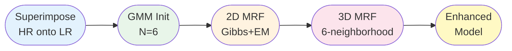

#### 4.4.5 多尺度岩石圈叠加方案 (新增)

针对 Tier 2/3 的区域高分辨率岩石圈模型（如 CSRM1.0 覆盖 0-120km、0.25°×0.3°×0.5km），需要与 Tier 1 全域模型进行深度维度的融合。

**两种实现路径**：

| 方案             | 做法                                                 | 优点                     | 缺点           |
| ---------------- | ---------------------------------------------------- | ------------------------ | -------------- |
| A: NC 层面预合并 | 独立脚本 `merge_litho_model.py` 在 NetCDF 网格上合并 | 简单、可独立验证、可视化 | 需要预处理步骤 |
| B: GLL 层面叠加  | `convert_nc_to_gll.py --overlay-model` 参数          | 一步到位                 | 脚本复杂度增加 |

**关键技术考虑**：

1. **参考模型一致性**：不同模型基于不同 1D 参考模型，叠加前需统一转为相对于同一参考的扰动 (δV/V)，在扰动域 blending 后加回
2. **深度过渡带**：在岩石圈模型底部（如 100-140km）进行 depth-weighted blending，避免人为速度跳变
3. **空间覆盖不匹配**：岩石圈模型覆盖范围小于全域模型，需要水平边界过渡

**推荐优先级**：方案 A（NC 预合并）→ 验证效果 → 如有需要再实现方案 B

#### 4.4.6 融合策略路线图与优先级

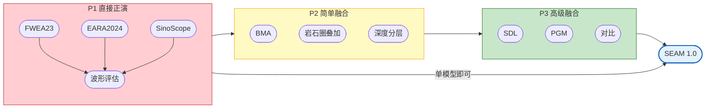

**策略原则**：

1. **FWI 不等融合**：Tier 1 模型（FWEA23/EARA2024）本身已是 FWI 产物，可直接作为初始模型。先跑通正演流程、获得波形评估结果，再决定是否需要更复杂的融合
2. **融合服务于论文**：SDL/PGM 等高级融合方法是 Paper I 的核心方法论贡献，应作为独立的科学工作推进，不作为 FWI 流程的前置依赖
3. **数据驱动选择**：最终用哪个初始模型，由波形拟合评分（χ^T, χ^A, χ^F, NZCC）决定，而非模型空间的先验偏好

> **Open Issues**:
>
> - 🔴 SDL 窗口尺度 (6°) 比论文 (0.18°) 大 33 倍——字典学习是否仍有物理意义？
> - 🟡 岩石圈叠加方案中不同模型参考模型不一致（PREM vs ak135），需统一扰动基准
> - 🟡 BMA 后验概率 P(M_k|D) 基于什么数据？正演波形还是模型空间统计量？
> - ⏳ PGM (Zhou 2024) 从 2D 切片扩展到 3D 的计算量和收敛性未知

---

### 4.5 模块 5: 可视化 (Visualization)

| 模块           | 工具                 | 用途           | 输出格式 |
| -------------- | -------------------- | -------------- | -------- |
| **Basemap**    | PyGMT                | 底图、构造特征 | jpg/pdf  |
| **GCMT**       | PyGMT                | 地震事件分布   | jpg/pdf  |
| **Stations**   | PyGMT + Matplotlib   | 台站网络       | jpg/pdf  |
| **Clustering** | Matplotlib + Seaborn | 聚类结果       | jpg/pdf  |
| **Velocity**   | PyGMT + Cartopy      | 速度模型切片   | jpg/pdf  |
| **Waveforms**  | Matplotlib           | 波形对比       | jpg/pdf  |

**命名规范**: `{模块号}-{子序号}_{描述}_{参数}.{格式}`

---

## 5. 核心方法论与算法

### 5.1 SDL 耦合字典学习

#### 5.1.1 数学框架

**目标函数**:

$$\min_{D_1, D_2, C} \frac{1}{2}\|P_1^T - D_1 C^T\|_F^2 + \lambda \|C\|_1$$

$$\text{s.t. } D_2 = \arg\min_{D_2} \|P_2^T - D_2 C^T\|_F^2$$

#### 5.1.2 变换公式

$$c = \arg\min_c \frac{1}{2}\|p_1 - D_1 c\|_2^2 + \lambda \|c\|_1$$

$$\hat{p}_2 = D_2 c$$

#### 5.1.3 关键参数

| 参数     | 符号 | 推荐值 | 说明        |
| -------- | ---- | ------ | ----------- |
| 原子数   | K    | 20     | 字典大小    |
| 稀疏性   | λ    | 0.1    | L1 惩罚系数 |
| 窗口大小 | W    | 6°     | 物理窗口    |
| 步长     | S    | 1°     | 83% 重叠    |

### 5.2 PGM 概率图模型

#### 5.2.1 势能函数

**数据代价**:

$$\theta_0(X_{i,j,k}, A_{i,j,k}) = \frac{(A_{i,j,k} - \mu_n)^2}{\sigma_n^2}$$

**平滑代价**:

$$\theta_1(X_{i,j,k}, X_{i',j',k'}) = \begin{cases} 0 & X_{i,j,k} = X_{i',j',k'} \\ 1 & \text{otherwise} \end{cases}$$

### 5.3 Open Issues & 待讨论

| #   | 问题                                                                                                             | 类型     | 状态            |
| --- | ---------------------------------------------------------------------------------------------------------------- | -------- | --------------- |
| 5.1 | SDL 的耦合字典 (D₁, D₂) 训练集仅有两个模型（SinoScope + EARA2024/FWEA23），样本量极小——泛化能力存疑              | 方法论   | 🔴 需论证       |
| 5.2 | SDL 论文场景是同一区域不同分辨率，而本项目 Tier 1 模型源自不同反演方法/数据——字典学习的 LR→HR 映射假设是否成立？ | 前提假设 | 🔴 Paper I 核心 |
| 5.3 | PGM 势能函数中的平滑项 θ₁ 使用 Potts model（0/1 惩罚），是否过于简单？连续值速度模型的平滑应该是 L2 范数更合理   | 算法改进 | 🟡 需讨论       |
| 5.4 | SSIM 在地震学语境下的三个分量权重 (α, β, γ) 沿用图像处理默认值 (1,1,1)——地震学数据的结构分量可能更重要           | 参数调优 | 🟡 需实验       |

---

## 6. 数据流与处理流程

### 6.1 完整数据流图

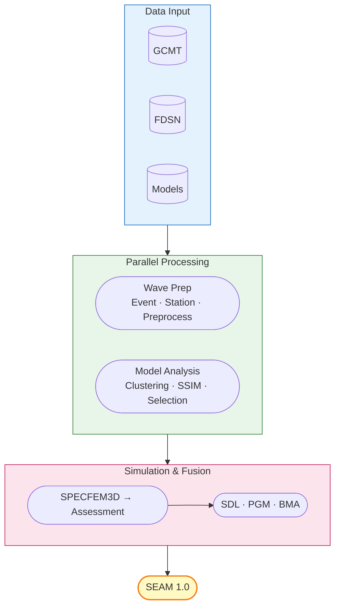

### 6.2 模型融合方法体系 (v2.1 — 多尺度架构)

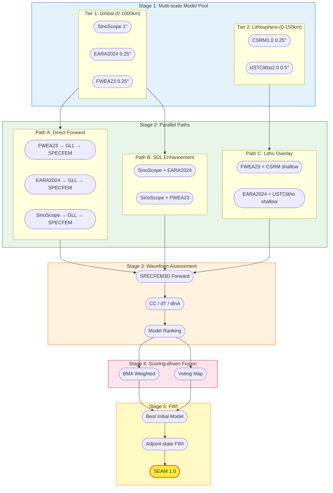

**关键设计变更 (v2.1)**：

1. **三条并行路径**：直接正演（最快验证）、SDL 增强（方法论贡献）、岩石圈叠加（浅部精度）
2. **波形评估在融合之前**：不假设融合一定优于单模型，用数据说话
3. **Scoring-driven 融合**：BMA/Voting 的权重来自波形拟合评分，而非模型空间先验

### 6.3 处理阶段定义

| 阶段        | 输入            | 处理                        | 输出                | 状态          |
| ----------- | --------------- | --------------------------- | ------------------- | ------------- |
| **Phase A** | 原始数据        | 数据准备                    | 标准化模型/检验数据 | ✅ 完成       |
| **Phase B** | 速度模型        | 模型空间分析（聚类/SSIM）   | 聚类标签/相似性矩阵 | ✅ 完成       |
| **Phase C** | Tier 1 模型     | SPECFEM 多模型正演          | 合成波形 (SAC)      | 🔄 开发中     |
| **Phase D** | 合成+观测波形   | 波形评估 (χ^T/χ^A/χ^F/NZCC) | 模型评分排名        | ⏳ 待开发     |
| **Phase E** | 多尺度模型+评分 | SDL/BMA/Voting/岩石圈叠加   | 融合候选模型池      | 🔄 SDL 验证中 |
| **Phase F** | 最优初始模型    | Adjoint-state FWI 迭代      | SEAM 1.0            | ⏳ 待开发     |

> **关键路径**: Phase A → C → D → F（单模型直接正演路线可最快到达 FWI）
> **科学贡献路径**: Phase A → B → E → Paper I（多尺度融合方法论独立推进）

### 6.4 Open Issues & 待讨论

| #   | 问题                                                                                                                        | 类型     | 状态        |
| --- | --------------------------------------------------------------------------------------------------------------------------- | -------- | ----------- |
| 6.1 | 关键路径（Phase A→C→D→F）的瓶颈在 Phase C（SPECFEM 正演），当前被 MPI 问题阻塞。如持续无法解决，是否有备选集群/云计算方案？ | 风险管理 | 🔴 需预案   |
| 6.2 | 科学贡献路径（Phase A→B→E→Paper I）与关键路径解耦后，SDL/PGM 的波形验证如何执行？没有正演就没有波形评估                     | 流程依赖 | 🟡 需讨论   |
| 6.3 | Stage 2 三条并行路径的实验设计需标准化：相同事件、相同台站、相同频段，否则对比无意义                                        | 实验设计 | 🟡 需规范化 |

---

## 7. 全流程可视化体系

### 7.1 可视化分组总览

| 组别     | 前缀    | 模块      | 数量     | 说明               |
| -------- | ------- | --------- | -------- | ------------------ |
| **M 组** | M01-M10 | 基础地图  | 10       | 底图、构造、地形   |
| **S 组** | S01-S20 | 台站/事件 | 20       | 台站网络、地震分布 |
| **V 组** | V01-V30 | 速度模型  | 30       | 模型切片、剖面     |
| **C 组** | C01-C10 | 聚类分析  | 10       | 聚类结果、统计     |
| **W 组** | W01-W20 | 波形评估  | 20       | 波形对比、拟合度   |
| **F 组** | F01-F50 | 融合结果  | 50       | SDL/PGM 各阶段     |
| **E 组** | E01-E20 | 评估指标  | 20       | 定量评估、对比     |
| **总计** | -       | -         | **~160** | -                  |

### 7.2 可视化代码模板

```python
class UnifiedVisualizer:
    """统一可视化器基类"""

    def __init__(self, output_dir: Path, dpi: int = 300):
        self.output_dir = output_dir
        self.dpi = dpi
        self.figure_format = ['jpg', 'pdf']

    def save_figure(self, fig, name: str, prefix: str = ''):
        """保存图片到多种格式"""
        for fmt in self.figure_format:
            path = self.output_dir / f"{prefix}{name}.{fmt}"
            fig.savefig(path, dpi=self.dpi, bbox_inches='tight')
```

### 7.3 Open Issues & 待讨论

| #   | 问题                                                                                     | 类型       | 状态              |
| --- | ---------------------------------------------------------------------------------------- | ---------- | ----------------- |
| 7.1 | ~160 张图片的命名体系（M/S/V/C/W/F/E 分组）与代码中 `{模块号}-{子序号}` 命名存在双重标准 | 规范统一   | 🟡 需决定采用哪套 |
| 7.2 | 发表质量图片的字体/色标/布局标准尚未统一——PyGMT 和 Matplotlib 风格差异明显               | 可视化规范 | 🟡 需模板化       |

---

## 8. 代码架构与规范

### 8.1 项目目录结构

```
EASTASIA-FWI/
├── .cursor/rules/                    # Cursor rules & design docs
│   ├── eastasia-fwi.mdc             # Project rules (auto-apply)
│   ├── EastAsia_FWI_Development.md  # 📌 This document
│   └── *.md                         # Module design docs
│
├── 1_Data_preparation/              # ✅ Data Preparation
├── 2_Model_space_analysis/          # ✅ Model Space Analysis
├── 3_Data_space_simulation/         # 🔄 Data Space Simulation
├── 4_Fusion/                        # 🔄 Model Fusion
│   ├── 4_1_Voting_map.py           #   ✅ Voting Map v1.0
│   ├── 4_2_BMA.py                  #   ✅ BMA v2.0
│   └── 4_3_SDL_Fusion_v3.4.py     #   🔄 SDL v3.4 (5600 行)
├── 5_Visualization/                 # ✅ Visualization
├── Paper_Figs/                      # 📄 Publication Figures
│
├── config/base_config.py            # ✅ Global config
├── data/
│   └── models/
│       ├── metadata/                # 23 个模型的元数据 & 原始文件
│       └── processed/               # 标准化 NetCDF
├── results/                         # Results output
├── figures/                         # Figures output
│
├── specfem/                         # 🔄 SPECFEM 正演工作区
│   ├── run_forward.bash             #   多模型正演主脚本
│   ├── convert_nc_to_gll.py         #   NC/HDF5→GLL 转换
│   ├── DATA/                        #   共享 Par_file/STATIONS/CMTSOLUTION
│   ├── models/                      #   原始模型 (NC/HDF5)
│   ├── specfem3d_globe_code_new/    #   SPECFEM v7.0.0 源码
│   ├── sem_config_tibet_v4/         #   区域配置 (constants.h.in)
│   ├── FWEA23/                      #   独立工作目录
│   ├── EARA2024/                    #   独立工作目录
│   └── SinoScope/                   #   独立工作目录
│
└── specfem_original/                # 备份：服务器成功编译的原始代码
    └── specfem3d_globe_code_new/
```

### 8.2 代码风格规范

```python
"""
EASTASIA-FWI 模块名称
======================

功能描述:
- 功能1
- 功能2

作者: EASTASIA-FWI Team
日期: 2026-xx-xx
版本: vX.X
"""

import sys
from pathlib import Path
from typing import Dict, List, Optional
from dataclasses import dataclass
import logging

# 项目配置
project_root = Path(__file__).parent.parent
sys.path.insert(0, str(project_root))
from config.base_config import BaseConfig
```

### 8.3 Open Issues & 待讨论

| #   | 问题                                                                    | 类型     | 状态      |
| --- | ----------------------------------------------------------------------- | -------- | --------- |
| 8.1 | 项目缺少自动化测试框架——没有 unit test，功能回归完全靠人工验证          | 工程质量 | 🟡 需规划 |
| 8.2 | `base_config.py` 路径为硬编码绝对路径，在本地/服务器/协作者之间不可移植 | 可移植性 | 🟡 需重构 |
| 8.3 | SDL v3.4 单文件 5600 行——超出可维护范围，需拆分为多模块                 | 代码维护 | 🟡 需重构 |
| 8.4 | `specfem/` 目录下脚本（bash + python 混合）缺少统一的执行入口和参数管理 | 工程化   | 🟡 需设计 |

---

## 9. 开发状态与里程碑

### 9.1 当前开发状态 (2026-03-25)

| 模块                         | 状态      | 完成度 | 说明                                       |
| ---------------------------- | --------- | ------ | ------------------------------------------ |
| **1. Data Preparation**      | ✅ 完成   | 95%    | 高质量完成                                 |
| **2. Model Space Analysis**  | ✅ 完成   | 90%    | 聚类/SSIM 核心完成                         |
| **3. Data Space Simulation** | 🔄 开发中 | 65%    | 多模型脚本完成，MPI 通信问题待解决         |
| **4. Fusion**                | 🔄 开发中 | 55%    | SDL v3.4 / BMA v2.0 完成，岩石圈叠加设计中 |
| **5. Visualization**         | ✅ 完成   | 85%    | 基本完成                                   |

**模块 3 详细进展**：

| 子模块            | 文件                         | 状态      | 说明                                       |
| ----------------- | ---------------------------- | --------- | ------------------------------------------ |
| 多模型正演脚本    | `run_forward.bash`           | ✅ 完成   | 3 模型独立工作目录 + SLURM                 |
| NC/HDF5→GLL 转换  | `convert_nc_to_gll.py`       | ✅ 完成   | 扰动插值 + NaN 预填充 + 域外 blend         |
| SPECFEM 编译/运行 | -                            | ⚠️ BUG    | face flag MPI 间歇性错误，待曙光工程师排查 |
| 波形评估          | `3_4_Waveform_assessment.py` | ⏳ 待开发 | 依赖正演成功                               |

**模块 4 详细进展**：

| 子模块     | 文件                     | 版本 | 状态      | 说明                     |
| ---------- | ------------------------ | ---- | --------- | ------------------------ |
| Voting Map | `4_1_Voting_map.py`      | v1.0 | ✅ 完成   | 模型间一致性投票         |
| BMA        | `4_2_BMA.py`             | v2.0 | ✅ 完成   | 25+ 可视化，后验概率分析 |
| SDL 融合   | `4_3_SDL_Fusion_v3.4.py` | v3.4 | 🔄 验证中 | 5600 行，2D 全深度变换   |
| PGM 融合   | -                        | -    | ⏳ 设计中 | 参考 Zhou et al. 2024    |
| 岩石圈叠加 | -                        | -    | ⏳ 设计中 | CSRM/USTClitho → Tier 1  |

### 9.2 里程碑计划

| Phase  | Task                         | Period            | Status       |
| ------ | ---------------------------- | ----------------- | ------------ |
| **A**  | Data Preparation             | 2025-09 ~ 2025-12 | ✅ Done      |
| **A**  | Model Space Analysis         | 2025-10 ~ 2026-01 | ✅ Done      |
| **B**  | SDL Fusion v3.4              | 2026-01 ~ 2026-03 | ✅ v3.4 完成 |
| **B**  | BMA v2.0                     | 2026-01 ~ 2026-02 | ✅ Done      |
| **C**  | SPECFEM 多模型正演架构       | 2026-03           | ✅ 脚本完成  |
| **C**  | 曙光集群 MPI 问题排查        | 2026-03 ~ 2026-04 | 🔄 Active    |
| **C**  | 三模型正演完成               | 2026-04 ~ 2026-05 | ⏳ Blocked   |
| **D**  | 波形评估 (χ^T/χ^A/χ^F/NZCC)  | 2026-05 ~ 2026-06 | ⏳ Planned   |
| **E**  | 多尺度融合 (岩石圈叠加+BMA)  | 2026-05 ~ 2026-07 | ⏳ Planned   |
| **E**  | SDL/PGM 方法论对比 → Paper I | 2026-03 ~ 2026-08 | 🔄 Active    |
| **F**  | FWI 初始模型选择 + 测试      | 2026-07 ~ 2026-09 | ⏳ Planned   |
| **F**  | Adjoint-state FWI 迭代       | 2026-09 ~ 2026-11 | ⏳ Planned   |
| **🎯** | **SEAM 1.0 Release**         | **2026-12**       | 🎯 Milestone |

### 9.3 当前重点任务

| 优先级 | 任务                               | 模块         | 状态   |
| ------ | ---------------------------------- | ------------ | ------ |
| 🔴 高  | 解决 SPECFEM face flag MPI 问题    | 3_Simulation | ⚠️ BUG |
| 🔴 高  | 联系曙光工程师排查 InfiniBand      | 3_Simulation | 🔄     |
| 🟡 中  | SDL v3.4 全深度验证 + Paper I 图表 | 4_Fusion     | 🔄     |
| 🟡 中  | 岩石圈叠加方案原型                 | 4_Fusion     | ⏳     |
| 🟢 低  | 波形评估指标体系设计               | 3_Simulation | ⏳     |

### 9.4 Open Issues & 待讨论

| #   | 问题                                                                                                                  | 类型       | 状态      |
| --- | --------------------------------------------------------------------------------------------------------------------- | ---------- | --------- |
| 9.1 | **MPI face flag 问题**——已尝试多种修复（编译参数、MPI fabric 设置、节点排除），均未稳定解决。是否需要迁移到其他集群？ | 🔴 BUG问题 | ⚠️ 需处理 |

---

## 10. 参考文献

### 10.1 模型融合方法论

1. **Zhang, H., & Ben-Zion, Y. (2024)**. _Enhancing regional seismic velocity models with higher-resolution local results using sparse dictionary learning_. JGR: Solid Earth, 129, e2023JB027016. **[SDL 核心参考]**

2. **Zhou, Z., Gerstoft, P., & Olsen, K. B. (2024)**. _3D Multiresolution Velocity Model Fusion with Probability Graphical Models_. BSSA, 114(3), 1279-1292. **[PGM 核心参考]**

3. **Yang, J., et al. (2012)**. _Coupled dictionary training for image super-resolution_. IEEE TIP, 21(8), 3467-3478. **[耦合字典理论]**

4. **Bianco, M. J., & Gerstoft, P. (2017)**. _Dictionary learning of sound speed profiles_. JASA, 141(3), 1749-1758.

5. **Wang, Z., et al. (2004)**. _Image quality assessment: from error visibility to structural similarity_. IEEE TIP, 13(4), 600-612. **[SSIM]**

### 10.2 速度模型文献

6. **Liu, Q., et al. (2024)**. _FWEA23: A 3-D full-waveform model of the crust and upper mantle in East Asia_. EPSL, 629, 118764.

7. **Xi, Z., et al. (2024)**. _EARA2024: A high-resolution adjoint tomography model of East Asia_. GJI, ggae302.

8. **Ma, J., et al. (2022)**. _SinoScope1.0: A 3-D reference model of the crust and upper mantle beneath China_. JGR, 127, e2022JB024957.

9. **Wen, L., & Yu, Y. (2023)**. _CSRM1.0: A crustal and upper mantle S-wave velocity model for China_. EPP, epp2023078.

10. **Han, S., et al. (2022)**. _USTClitho2.0: An updated unified seismic tomography model of the lithosphere beneath China_. SRL, 93, 0220210122.

### 10.3 波形评估与技术文献

11. **Zhou, T., et al. (2021)**. _Assessment of seismic tomographic models of the contiguous United States using full-waveform simulation_. GJI, 228(2), 1392-1414. **[波形评估框架核心参考]**

12. **Tromp, J., Tape, C., & Liu, Q. (2005)**. _Seismic tomography, adjoint methods, time reversal and banana-doughnut kernels_. GJI, 160(1), 195-216. **[Misfit 定义]**

13. **Sawade, L., et al. (2022)**. _Global Centroid Moment Tensor Solutions in a Heterogeneous Earth: The CMT3D Catalog_. GJI. **[CMT3D 震源修正]**

14. **Komatitsch, D., & Tromp, J. (2002)**. _Spectral-element simulations of global seismic wave propagation_. GJI, 149(2), 390-412.

15. **Tape, C., et al. (2010)**. _Seismic tomography of the southern California crust based on spectral-element and adjoint methods_. GJI, 180(1), 433-462.

---

**文档版本**: v2.2.0  
**创建日期**: 2026-01-12  
**最后更新**: 2026-03-25  
**作者**: EASTASIA-FWI Team  
**项目状态**: 🔄 积极开发中  
**当前BUG**: SPECFEM 曙光集群 MPI face flag 间歇性错误  
**关键路径**: 解决 MPI 问题 → 三模型正演完成 → 波形评估 → FWI  
**Open Issues 总计**: 31 项 (🔴 8 项需紧急处理 · 🟡 18 项需讨论/验证 · 🔵 3 项低优先 · ⏳ 2 项待启动)

---

_此文档为 EASTASIA-FWI 项目的总纲设计文档。v2.2 在每章末尾新增 Open Issues & 待讨论小节，系统梳理未解决问题。v2.1 重点更新了多尺度模型融合策略（§4.4）和 SPECFEM 多模型正演架构（§4.3）。_
