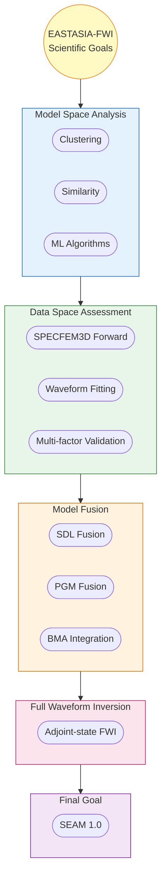

```mermaid
flowchart TB
    Root((EASTASIA-FWI<br/>Scientific Goals))

    subgraph MSA["Model Space Analysis"]
        A1([Clustering])
        A2([Similarity])
        A3([ML Algorithms])
    end

    subgraph DSA["Data Space Assessment"]
        B1([SPECFEM3D Forward])
        B2([Waveform Fitting])
        B3([Multi-factor Validation])
    end

    subgraph MF["Model Fusion"]
        C1([SDL Fusion])
        C2([PGM Fusion])
        C3([BMA Integration])
    end

    subgraph FWI["Full Waveform Inversion"]
        D1([Adjoint-state FWI])
    end

    subgraph FG["Final Goal"]
        E1([SEAM 1.0])
    end

    Root --> MSA --> DSA --> MF --> FWI --> FG

    style Root fill:#fff9c4,stroke:#f57f17
    style MSA fill:#e3f2fd,stroke:#1565c0
    style DSA fill:#e8f5e9,stroke:#2e7d32
    style MF fill:#fff3e0,stroke:#ef6c00
    style FWI fill:#fce4ec,stroke:#c2185b
    style FG fill:#f3e5f5,stroke:#7b1fa2
```
