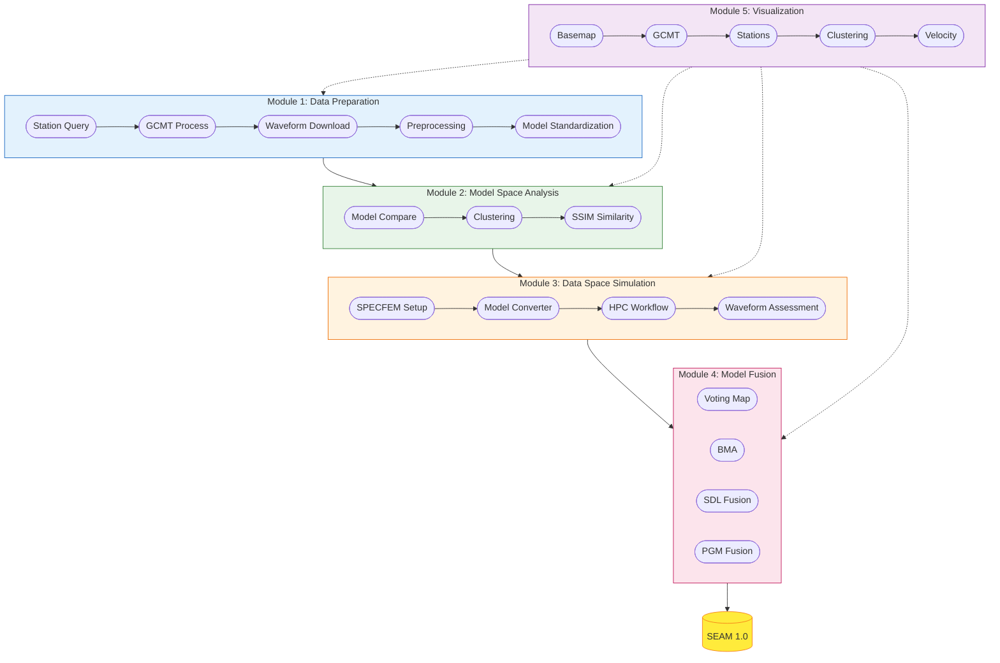

```mermaid
flowchart TB
    subgraph Module1["Module 1: Data Preparation"]
        direction LR
        A1([Station Query]) --> A2([GCMT Process])
        A2 --> A3([Waveform Download])
        A3 --> A4([Preprocessing])
        A4 --> A5([Model Standardization])
    end

    subgraph Module2["Module 2: Model Space Analysis"]
        direction LR
        B1([Model Compare]) --> B2([Clustering])
        B2 --> B3([SSIM Similarity])
    end

    subgraph Module3["Module 3: Data Space Simulation"]
        direction LR
        C1([SPECFEM Setup]) --> C2([Model Converter])
        C2 --> C3([HPC Workflow])
        C3 --> C4([Waveform Assessment])
    end

    subgraph Module4["Module 4: Model Fusion"]
        direction LR
        D1([Voting Map])
        D2([BMA])
        D3([SDL Fusion])
        D4([PGM Fusion])
    end

    subgraph Module5["Module 5: Visualization"]
        direction LR
        E1([Basemap]) --> E2([GCMT])
        E2 --> E3([Stations])
        E3 --> E4([Clustering])
        E4 --> E5([Velocity])
    end

    Module1 --> Module2
    Module2 --> Module3
    Module3 --> Module4
    Module4 --> Output
    Module5 -.-> Module1
    Module5 -.-> Module2
    Module5 -.-> Module3
    Module5 -.-> Module4

    Output[(SEAM 1.0)]

    style Module1 fill:#e3f2fd,stroke:#1565c0
    style Module2 fill:#e8f5e9,stroke:#2e7d32
    style Module3 fill:#fff3e0,stroke:#ef6c00
    style Module4 fill:#fce4ec,stroke:#c2185b
    style Module5 fill:#f3e5f5,stroke:#7b1fa2
    style Output fill:#ffeb3b,stroke:#f57f17
```
