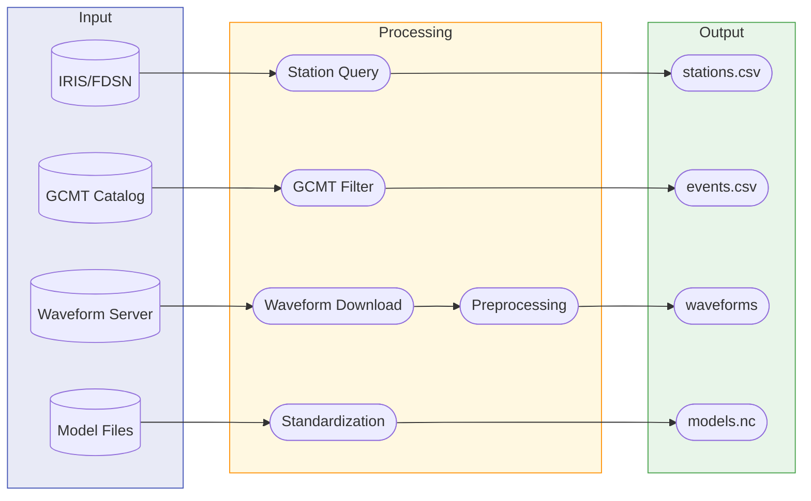

```mermaid
flowchart LR
    subgraph Input["Input"]
        I1[(IRIS/FDSN)]
        I2[(GCMT Catalog)]
        I3[(Waveform Server)]
        I4[(Model Files)]
    end

    subgraph Process["Processing"]
        P1([Station Query])
        P2([GCMT Filter])
        P3([Waveform Download])
        P4([Preprocessing])
        P5([Standardization])
    end

    subgraph Output["Output"]
        O1([stations.csv])
        O2([events.csv])
        O3([waveforms])
        O4([models.nc])
    end

    I1 --> P1 --> O1
    I2 --> P2 --> O2
    I3 --> P3 --> P4 --> O3
    I4 --> P5 --> O4

    style Input fill:#e8eaf6,stroke:#3f51b5
    style Process fill:#fff8e1,stroke:#ff8f00
    style Output fill:#e8f5e9,stroke:#43a047
```
