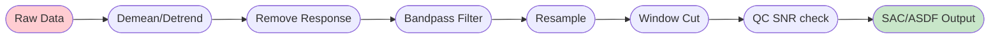

```mermaid
flowchart LR
    A([Raw Data]) --> B([Demean/Detrend])
    B --> C([Remove Response])
    C --> D([Bandpass Filter])
    D --> E([Resample])
    E --> F([Window Cut])
    F --> G([QC SNR check])
    G --> H([SAC/ASDF Output])

    style A fill:#ffcdd2
    style H fill:#c8e6c9
```
