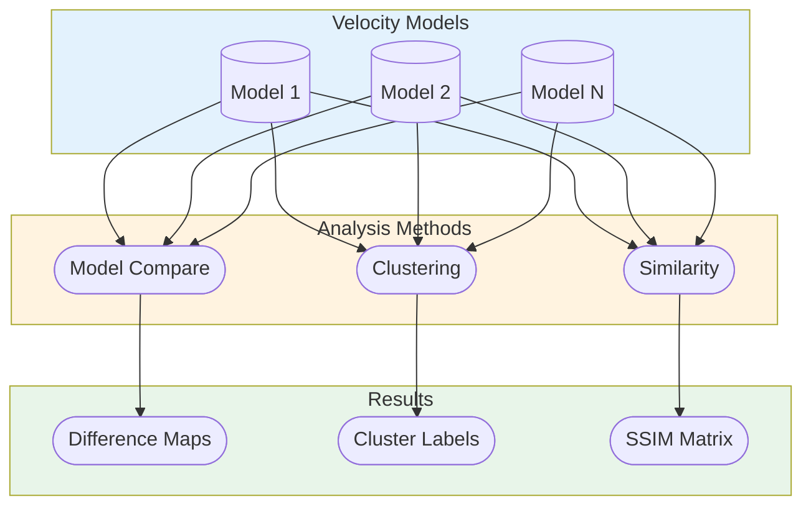

```mermaid
flowchart TB
    subgraph Input["Velocity Models"]
        M1[(Model 1)]
        M2[(Model 2)]
        M3[(Model N)]
    end

    subgraph Analysis["Analysis Methods"]
        A1([Model Compare])
        A2([Clustering])
        A3([Similarity])
    end

    subgraph Output["Results"]
        O1([Difference Maps])
        O2([Cluster Labels])
        O3([SSIM Matrix])
    end

    M1 & M2 & M3 --> A1 --> O1
    M1 & M2 & M3 --> A2 --> O2
    M1 & M2 & M3 --> A3 --> O3

    style Input fill:#e3f2fd
    style Analysis fill:#fff3e0
    style Output fill:#e8f5e9
```
