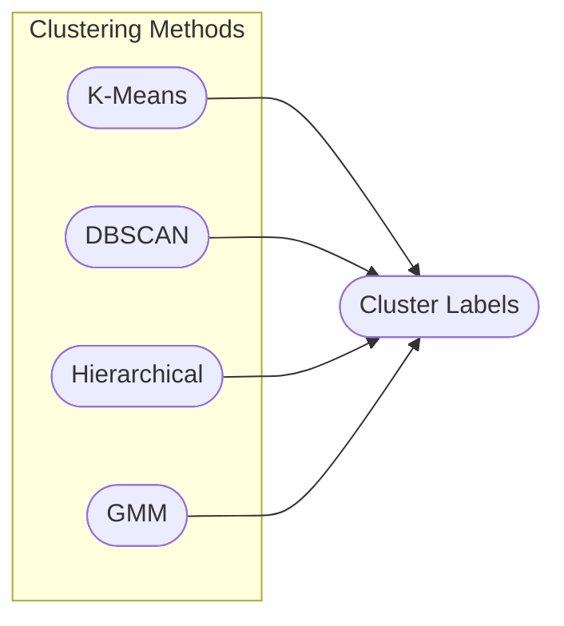

```mermaid
flowchart LR
    subgraph Methods["Clustering Methods"]
        KM([K-Means])
        DB([DBSCAN])
        HC([Hierarchical])
        GM([GMM])
    end

    KM --> Result
    DB --> Result
    HC --> Result
    GM --> Result

    Result([Cluster Labels])
```
