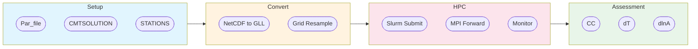

```mermaid
flowchart LR
    subgraph Setup["Setup"]
        S1([Par_file])
        S2([CMTSOLUTION])
        S3([STATIONS])
    end

    subgraph Convert["Convert"]
        C1([NetCDF to GLL])
        C2([Grid Resample])
    end

    subgraph HPC["HPC"]
        H1([Slurm Submit])
        H2([MPI Forward])
        H3([Monitor])
    end

    subgraph Assess["Assessment"]
        A1([CC])
        A2([dT])
        A3([dlnA])
    end

    Setup --> Convert --> HPC --> Assess

    style Setup fill:#e1f5fe
    style Convert fill:#fff3e0
    style HPC fill:#fce4ec
    style Assess fill:#e8f5e9
```
