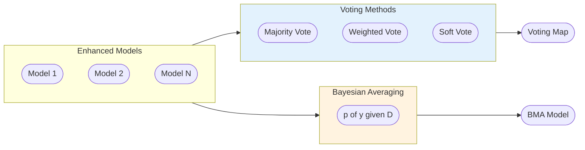

```mermaid
flowchart LR
    subgraph Input["Enhanced Models"]
        E1([Model 1])
        E2([Model 2])
        E3([Model N])
    end

    subgraph Voting["Voting Methods"]
        V1([Majority Vote])
        V2([Weighted Vote])
        V3([Soft Vote])
    end

    subgraph BMA["Bayesian Averaging"]
        B1(["p of y given D"])
    end

    Input --> Voting --> Result1([Voting Map])
    Input --> BMA --> Result2([BMA Model])

    style Voting fill:#e3f2fd
    style BMA fill:#fff3e0
```
