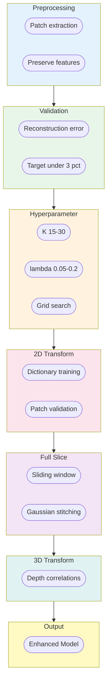

```mermaid
flowchart TB
    subgraph Prep["Preprocessing"]
        P1([Patch extraction])
        P2([Preserve features])
    end

    subgraph Valid["Validation"]
        V1([Reconstruction error])
        V2([Target under 3 pct])
    end

    subgraph Hyper["Hyperparameter"]
        H1([K 15-30])
        H2([lambda 0.05-0.2])
        H3([Grid search])
    end

    subgraph Trans2D["2D Transform"]
        T1([Dictionary training])
        T2([Patch validation])
    end

    subgraph Slice["Full Slice"]
        S1([Sliding window])
        S2([Gaussian stitching])
    end

    subgraph Trans3D["3D Transform"]
        D1([Depth correlations])
    end

    subgraph Out["Output"]
        O1([Enhanced Model])
    end

    Prep --> Valid --> Hyper --> Trans2D --> Slice --> Trans3D --> Out

    style Prep fill:#e3f2fd
    style Valid fill:#e8f5e9
    style Hyper fill:#fff3e0
    style Trans2D fill:#fce4ec
    style Slice fill:#f3e5f5
    style Trans3D fill:#e0f2f1
    style Out fill:#fff9c4
```
