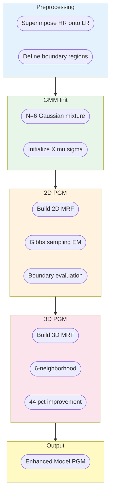

```mermaid
flowchart TB
    subgraph Prep["Preprocessing"]
        P1([Superimpose HR onto LR])
        P2([Define boundary regions])
    end

    subgraph Init["GMM Init"]
        G1([N=6 Gaussian mixture])
        G2([Initialize X mu sigma])
    end

    subgraph PGM2D["2D PGM"]
        M1([Build 2D MRF])
        M2([Gibbs sampling EM])
        M3([Boundary evaluation])
    end

    subgraph PGM3D["3D PGM"]
        D1([Build 3D MRF])
        D2([6-neighborhood])
        D3([44 pct improvement])
    end

    subgraph Out["Output"]
        O1([Enhanced Model PGM])
    end

    Prep --> Init --> PGM2D --> PGM3D --> Out

    style Prep fill:#e3f2fd
    style Init fill:#e8f5e9
    style PGM2D fill:#fff3e0
    style PGM3D fill:#fce4ec
    style Out fill:#fff9c4
```
