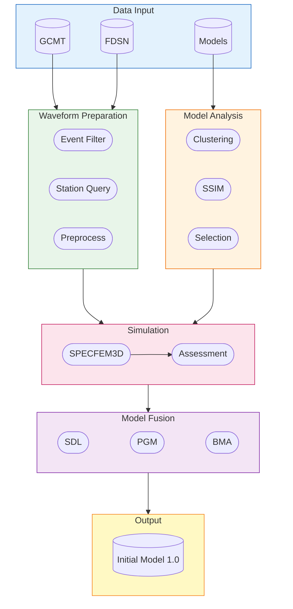

```mermaid
flowchart TB
    subgraph DataInput["Data Input"]
        GCMT[(GCMT)]
        FDSN[(FDSN)]
        Models[(Models)]
    end

    subgraph Row2[" "]
        direction LR
        subgraph WavePrep["Waveform Preparation"]
            W1([Event Filter])
            W2([Station Query])
            W3([Preprocess])
        end
        subgraph ModelAnalysis["Model Analysis"]
            M1([Clustering])
            M2([SSIM])
            M3([Selection])
        end
    end

    subgraph Row3[" "]
        direction LR
        subgraph Simulation["Simulation"]
            S1([SPECFEM3D])
            S2([Assessment])
        end
        subgraph Fusion["Model Fusion"]
            direction LR
            F1([SDL])
            F2([PGM])
            F3([BMA])
        end
    end

    subgraph Output["Output"]
        O1[(Initial Model 1.0)]
    end

    GCMT --> WavePrep
    FDSN --> WavePrep
    Models --> ModelAnalysis
    WavePrep --> Simulation
    ModelAnalysis --> Simulation
    Simulation --> Fusion
    Fusion --> Output
    S1 --> S2
    F1 ~~~ F2 ~~~ F3

    style DataInput fill:#e3f2fd,stroke:#1565c0
    style Row2 fill:none,stroke:none
    style Row3 fill:none,stroke:none
    style WavePrep fill:#e8f5e9,stroke:#2e7d32
    style ModelAnalysis fill:#fff3e0,stroke:#ef6c00
    style Simulation fill:#fce4ec,stroke:#c2185b
    style Fusion fill:#f3e5f5,stroke:#7b1fa2
    style Output fill:#fff9c4,stroke:#f57f17
```
