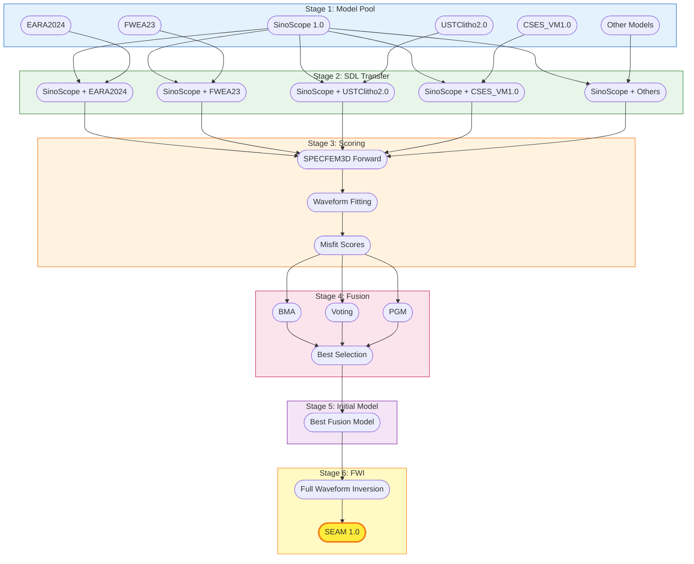

```mermaid
flowchart TB
    subgraph Stage1["Stage 1: Model Pool"]
        LR(["SinoScope 1.0"])
        HR1(["EARA2024"])
        HR2(["FWEA23"])
        HR3(["USTClitho2.0"])
        HR4(["CSES_VM1.0"])
        HR5(["Other Models"])
    end

    subgraph Stage2["Stage 2: SDL Transfer"]
        SDL1(["SinoScope + EARA2024"])
        SDL2(["SinoScope + FWEA23"])
        SDL3(["SinoScope + USTClitho2.0"])
        SDL4(["SinoScope + CSES_VM1.0"])
        SDL5(["SinoScope + Others"])
    end

    subgraph Stage3["Stage 3: Scoring"]
        FWD(["SPECFEM3D Forward"])
        FIT(["Waveform Fitting"])
        SCORE(["Misfit Scores"])
    end

    subgraph Stage4["Stage 4: Fusion"]
        BMA(["BMA"])
        VOTE(["Voting"])
        PGMF(["PGM"])
        COMPARE(["Best Selection"])
    end

    subgraph Stage5["Stage 5: Initial Model"]
        BEST(["Best Fusion Model"])
    end

    subgraph Stage6["Stage 6: FWI"]
        FWI(["Full Waveform Inversion"])
        SEAM(["SEAM 1.0"])
    end

    LR --> SDL1 & SDL2 & SDL3 & SDL4 & SDL5
    HR1 --> SDL1
    HR2 --> SDL2
    HR3 --> SDL3
    HR4 --> SDL4
    HR5 --> SDL5

    SDL1 & SDL2 & SDL3 & SDL4 & SDL5 --> FWD --> FIT --> SCORE

    SCORE --> BMA & VOTE & PGMF
    BMA & VOTE & PGMF --> COMPARE --> BEST

    BEST --> FWI --> SEAM

    style Stage1 fill:#e3f2fd,stroke:#1565c0
    style Stage2 fill:#e8f5e9,stroke:#2e7d32
    style Stage3 fill:#fff3e0,stroke:#ef6c00
    style Stage4 fill:#fce4ec,stroke:#c2185b
    style Stage5 fill:#f3e5f5,stroke:#7b1fa2
    style Stage6 fill:#fff9c4,stroke:#f57f17
    style SEAM fill:#ffeb3b,stroke:#f57f17,stroke-width:3px
```
